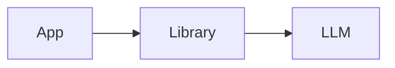
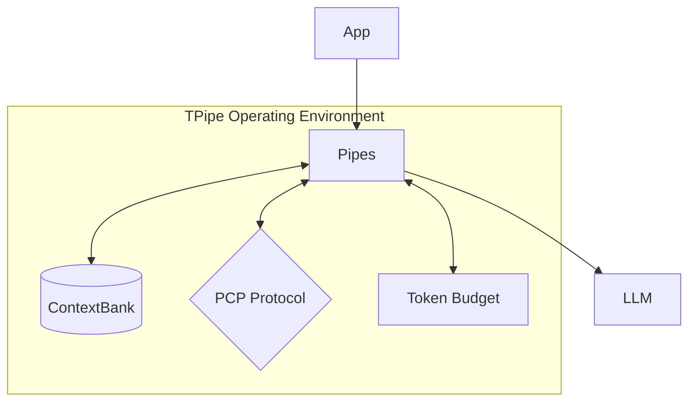

# TPipe: The Agent Operating Environment

**TPipe is the Agent Operating Environment for engineering robust, deterministic AI systems.**

TPipe provides the managed substrate for AI agents, moving beyond simple library wrappers into a production-grade runtime. It treats LLM interactions as data flowing through a managed plumbing system: **Pipes** (Valves) transport data, **Pipelines** (Mainlines) route it, and **ContextWindow**/**ContextBank** (Reservoirs) provide persistent state. Built on Kotlin and GraalVM, it provides strict resource accounting, secure sandboxing, and structured reasoning for production-grade autonomous systems.

## Different by Design: Substrate vs. Harness

TPipe is a **Substrate**, not just a harness or a library. It provides the underlying structure and foundations that agents inhabit, managing memory, enforcing protocols, and governing resources.

### Traditional Harness


### TPipe Substrate


## Core Pillars

### 1. Runtime Control
*   **Deterministic Pipelines**: Orchestrate multi-stage AI workflows with sophisticated error handling and recovery.
*   **Pause/Resume/Jump**: Granular control over execution flow with declarative pause points for developer-in-the-loop validation.
*   **Resource Governance**: Strict token budgeting, automatic truncation, and cost enforcement.

### 2. Long-horizon Coherence
*   **ContextBank**: A global, persistent memory layer that maintains state across sessions and distributed systems.
*   **Semantic Compression**: Reduce prompt overhead through natural language legends and automatic context injection.
*   **Managed Reservoirs**: Hierarchical memory management with Page Keys and MiniBanks.

### 3. Bounded Autonomy
*   **Pipe Context Protocol (PCP)**: Secure, multi-language tool execution (Kotlin, JS, Python) with strict AST validation.
*   **Memory Introspection**: Controlled agent access to their own memory systems for self-correction.
*   **Guardrails & Security**: Built-in content moderation, DNS rebinding protection, and secure sandboxing.

## Case Studies
Explore how TPipe is used in the field for high-stakes automation:
- [Headless Use-Cases: TPipe in the Field](docs/case-studies/headless-use-cases.md)

## Documentation

### 🚀 Getting Started
- [Installation and Setup](docs/getting-started/installation-and-setup.md) - Requirements, installation, and environment setup
- [First Steps](docs/getting-started/first-steps.md) - Your first pipe and pipeline

### 🧠 Core Concepts
#### Fundamentals
- [Why TPipe? Architectural Deep Dive](docs/core-concepts/why-tpipe.md) - The paradigm shift from libraries to substrates
- [Pipe Class - Core Concepts](docs/core-concepts/pipe-class.md) - Understanding the fundamental Pipe class
- [Pipeline Class - Orchestrating Multiple Pipes](docs/core-concepts/pipeline-class.md) - Chaining pipes together
- [JSON Schema and System Prompts](docs/core-concepts/json-and-system-prompts.md) - Structured AI interactions

#### Context and Memory
- [Context Window - Memory Storage and Retrieval](docs/core-concepts/context-window.md) - TPipe's memory system
- [Context and Tokens - Token Management](docs/core-concepts/context-and-tokens.md) - Managing token usage and limits
- [Token Counting, Truncation, and Tokenizer Tuning](docs/core-concepts/token-counting-and-truncation.md) - Advanced token handling
- [Automatic Context Injection](docs/core-concepts/automatic-context-injection.md) - Seamless context integration
- [Semantic Compression - Prompt Token Reduction](docs/core-concepts/semantic-compression.md) - Legend-backed prompt compression for natural language

#### Global Context Management
- [ContextBank - Global Context Integration](docs/core-concepts/context-bank-integration.md) - Global context repository
- [Page Keys and Global Context](docs/core-concepts/page-keys-and-global-context.md) - Organized context retrieval
- [MiniBank and Multiple Page Keys](docs/core-concepts/minibank-and-multiple-page-keys.md) - Multi-context management
- [Pipeline Context Integration](docs/core-concepts/pipeline-context-integration.md) - Context sharing within pipelines

#### Developer-in-the-Loop Processing
- [Developer-in-the-Loop Functions](docs/core-concepts/developer-in-the-loop.md) - Code-based validation and transformation
- [Developer-in-the-Loop Pipes](docs/core-concepts/developer-in-the-loop-pipes.md) - AI-powered validation and transformation

#### Advanced Features
- [Reasoning Pipes](docs/core-concepts/reasoning-pipes.md) - Chain-of-thought reasoning capabilities
- [Streaming Callbacks](docs/core-concepts/streaming-callbacks.md) - Real-time token streaming with multiple callbacks
- [Pipeline Flow Control](docs/core-concepts/pipeline-flow-control.md) - Dynamic routing and conditional execution
- [Error Handling and Propagation](docs/core-concepts/error-handling.md) - Programmatic error capture and debugging
- [Tracing and Debugging](docs/core-concepts/tracing-and-debugging.md) - Monitoring and troubleshooting

### 🏗️ Container Architecture
- [Container Overview](docs/containers/container-overview.md) - Introduction to TPipe containers
- [Manifold - Multi-Agent Orchestration](docs/containers/manifold.md) - Coordinating multiple AI agents
- [Manifold DSL Builder](docs/containers/manifold.md#dsl-builder) - Build and initialize manifolds in one Kotlin DSL block
- [Manifold Setup Checklist](docs/containers/manifold.md#startup-checklist) - Required manager, worker, memory, and `init()` steps before startup
- [Connector - Pipeline Branching](docs/containers/connector.md) - Conditional pipeline routing
- [Splitter - Parallel Processing](docs/containers/splitter.md) - Concurrent pipeline execution
- [Junction - Discussion and Workflow Harness](docs/containers/junction.md) - Collaborative discussion, voting, and workflow handoff
- [MultiConnector - Advanced Routing](docs/containers/multiconnector.md) - Complex routing patterns
- [DistributionGrid - Distributed Node Grid](docs/containers/distributiongrid.md) - Distributed node routing, discovery, and remote handoff
- [Cross-Cutting Topics](docs/containers/cross-cutting-topics.md) - Shared container concepts

### 🔧 Advanced Concepts
#### Pipe Context Protocol (PCP)
- [Pipe Context Protocol Overview](docs/advanced-concepts/pipe-context-protocol.md) - TPipe's native tool protocol
- [Basic PCP Usage](docs/advanced-concepts/basic-pcp-usage.md) - Getting started with PCP
- [Intermediate PCP Features](docs/advanced-concepts/intermediate-pcp-features.md) - Advanced PCP capabilities
- [PCP Kotlin and JavaScript Support](docs/advanced-concepts/pcp-kotlin-javascript.md) - Kotlin/JS scripting in PCP
- [Advanced Session Management](docs/advanced-concepts/advanced-session-management.md) - Complex session handling
- [Conversation History Management](docs/advanced-concepts/conversation-history-management.md) - Managing conversation state

#### Memory and Agent Systems
- [Remote Memory](docs/advanced-concepts/remote-memory.md) - Distributed memory hosting and access
- [Memory Introspection](docs/advanced-concepts/memory-introspection.md) - Agent memory access control

#### Tracing and Monitoring
- [TraceServer - Remote Trace Dashboard](docs/advanced-concepts/trace-server.md) - Real-time web dashboard for viewing agent traces

#### P2P Agent Communication
- [P2P Overview](docs/advanced-concepts/p2p/p2p-overview.md) - Distributed agent communication
- [P2P Descriptors and Transport](docs/advanced-concepts/p2p/p2p-descriptors-and-transport.md) - Agent discovery and addressing
- [P2P Registry and Routing](docs/advanced-concepts/p2p/p2p-registry-and-routing.md) - Agent management and routing
- [P2P Requests and Templates](docs/advanced-concepts/p2p/p2p-requests-and-templates.md) - Request handling and templates
- [P2P Requirements and Validation](docs/advanced-concepts/p2p/p2p-requirements-and-validation.md) - Security and validation

### ☁️ Provider Integration
- [AWS Bedrock Getting Started](docs/bedrock/getting-started.md) - Setup, configuration, and first steps
- [AWS Bedrock Inference Binding](docs/bedrock/inference-binding.md) - Cross-region model access and configuration
- [AWS Bedrock Guardrails](docs/bedrock/guardrails.md) - Content safety and moderation with Guardrails
- [Ollama Getting Started](docs/ollama/getting-started.md) - Running TPipe with local models

### 📚 API Reference
#### Core APIs
- [Pipe Class API](docs/api/pipe.md) - Complete Pipe class reference
- [Pipeline Class API](docs/api/pipeline.md) - Pipeline orchestration methods
- [MultimodalContent API](docs/api/multimodal-content.md) - Content handling and processing

#### Context Management APIs
- [ContextWindow API](docs/api/context-window.md) - Memory and context operations
- [ContextBank API](docs/api/context-bank.md) - Global context management
- [ContextLock API](docs/api/context-lock.md) - Context access control and security
- [MiniBank API](docs/api/minibank.md) - Multi-page context handling
- [ConverseHistory API](docs/api/converse-history.md) - Conversation management
- [TodoList API](docs/api/todolist.md) - Task management for AI workflows
- [Dictionary API](docs/api/dictionary.md) - Token counting and truncation
- [Lorebook API](docs/api/lorebook.md) - Knowledge base management

#### Advanced APIs
- [Debug Package API](docs/api/debug-package.md) - Tracing and monitoring tools
- [P2P Interface API](docs/api/p2p-interface.md) - Agent communication interface
- [P2P Package API](docs/api/p2p-package.md) - Distributed agent system
- [PipeContextProtocol API](docs/api/pipe-context-protocol.md) - Tool execution framework
- [TPipeConfig API](docs/api/tpipe-config.md) - Configuration and directory management
- [Util Package API](docs/api/util-package.md) - Utility functions and helpers

#### Extension APIs
- [TPipe-MCP Package API](docs/api/tpipe-mcp-package.md) - Model Context Protocol bridge and server hosting
- [TPipe-Defaults API](docs/api/tpipe-defaults-package.md) - Pre-configured components and reasoning

## Quick Start

```kotlin
import bedrockPipe.BedrockPipe

val pipe = BedrockPipe()
    .setRegion("us-east-1")
    .setModel("anthropic.claude-3-sonnet-20240229-v1:0")
    .setSystemPrompt("You are an automated security auditor responsible for identifying PII leakage in application logs.")
    .setTemperature(0.7)

val result = pipe.execute("Analyze the following log entries for security vulnerabilities...")
println(result.text)
```

## Requirements

- **Java 24** or higher (GraalVM CE 24 recommended)
- **Kotlin 1.9.0** or higher
- **Gradle** with Kotlin DSL

## Installation

```kotlin
dependencies {
    implementation("com.TTT:TPipe:0.0.1")
    implementation("com.TTT:TPipe-Bedrock:0.0.1")  // For AWS Bedrock
    implementation("com.TTT:TPipe-Ollama:0.0.1")   // For Ollama
}
```

## Licensing

TPipe is dual-licensed to meet the needs of both open-source developers and enterprise organizations.

*   **Open Source**: Licensed under the **GNU Affero General Public License v3 (AGPL-3.0)**.
*   **Commercial**: For closed-source commercial applications and proprietary integrations.
*   **Enterprise**: Custom support, SLA, and feature prioritization for large-scale deployments.

Contact [contact@tentrilliontriangles.com] for commercial and enterprise inquiries.
