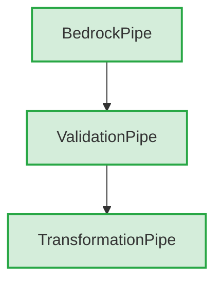

# TPipe Tracing System - Complete Technical Documentation

## Table of Contents
1. [System Overview](#system-overview)
2. [Architecture and Design](#architecture-and-design)
3. [Core Components](#core-components)
4. [Integration Points](#integration-points)
5. [Configuration System](#configuration-system)
6. [Verbosity and Filtering](#verbosity-and-filtering)
7. [Provider-Specific Implementation](#provider-specific-implementation)
8. [Visualization and Output](#visualization-and-output)
9. [Testing Infrastructure](#testing-infrastructure)
10. [Usage Patterns](#usage-patterns)
11. [Performance Characteristics](#performance-characteristics)
12. [File Structure Reference](#file-structure-reference)
13. [API Reference](#api-reference)
14. [Extension Guidelines](#extension-guidelines)

---

## System Overview

### Purpose and Scope
The TPipe Tracing System is a comprehensive debugging and monitoring solution designed to provide complete visibility into pipeline execution within the TPipe framework. It captures detailed execution traces, performance metrics, error information, and provides multiple visualization formats for analysis.

### Key Design Principles
1. **Zero Performance Impact When Disabled** - No overhead in production when tracing is off
2. **Comprehensive Coverage** - Traces all major execution phases and operations
3. **Configurable Verbosity** - Four detail levels from minimal to debug
4. **Multiple Output Formats** - Console, HTML, JSON, and Markdown support
5. **Provider Agnostic** - Works with all TPipe provider implementations
6. **Failure Analysis** - Automatic problem detection and suggested fixes
7. **Thread Safe** - Safe for concurrent pipeline execution

### System Status
- **Implementation Status**: ✅ FULLY IMPLEMENTED AND PRODUCTION READY
- **Test Coverage**: ✅ COMPREHENSIVE UNIT TESTS
- **Documentation**: ✅ COMPLETE WITH EXAMPLES
- **Provider Integration**: ✅ AWS BEDROCK, OLLAMA, NOVA
- **Performance**: ✅ ZERO IMPACT WHEN DISABLED

---

## Architecture and Design

### High-Level Architecture

```
┌─────────────────────────────────────────────────────────────┐
│                    TPipe Application Layer                   │
├─────────────────────────────────────────────────────────────┤
│  Pipeline Class                    │  Pipe Base Class       │
│  - Pipeline coordination           │  - Individual pipe     │
│  - Trace report generation         │    execution tracing   │
│  - Failure analysis                │  - Event generation    │
├─────────────────────────────────────────────────────────────┤
│                    Provider-Specific Pipes                  │
│  BedrockPipe  │  OllamaPipe  │  NovaPipe  │  Custom Pipes  │
│  - API calls  │  - Server    │  - Canvas  │  - User        │
│    tracing    │    tracing   │    tracing │    defined     │
├─────────────────────────────────────────────────────────────┤
│                      Debug Package                          │
│  PipeTracer   │  TraceEvent  │  Visualizer │  Config       │
│  - Central    │  - Event     │  - Output   │  - Settings   │
│    coordinator│    structure │    formats  │    management │
├─────────────────────────────────────────────────────────────┤
│                    Storage and Output                       │
│  Memory Store │  JSON Export │  HTML Report│  Console Out  │
│  - Event      │  - Machine   │  - Rich     │  - Developer  │
│    collection │    readable  │    visual   │    friendly   │
└─────────────────────────────────────────────────────────────┘
```

### Data Flow Architecture

```
Pipeline Execution → Pipe.trace() → EventPriorityMapper → PipeTracer → Storage
                                         ↓
                                   Verbosity Filter
                                         ↓
                                   Metadata Builder
                                         ↓
                                   TraceEvent Creation
                                         ↓
                                   TraceVisualizer → Output Formats
```

### Package Structure
```
com.TTT.Debug/
├── Core Infrastructure
│   ├── PipeTracer.kt           # Central coordination
│   ├── TraceEvent.kt           # Event data structure
│   ├── TraceEventType.kt       # Event type definitions
│   └── TracePhase.kt           # Execution phases
├── Configuration System
│   ├── TraceConfig.kt          # Configuration data class
│   ├── TracingBuilder.kt       # Builder pattern
│   ├── TraceDetailLevel.kt     # Verbosity levels
│   └── TraceFormat.kt          # Output formats
├── Filtering and Priority
│   └── TraceEventPriority.kt   # Event classification
├── Visualization
│   └── TraceVisualizer.kt      # Output generation
├── Utilities
│   ├── PipeExtensions.kt       # Extension methods
│   ├── FailureAnalysis.kt      # Failure analysis
│   └── TracingExample.kt       # Usage examples
└── Testing
    ├── TraceEventTest.kt       # Event testing
    ├── PipeTracerTest.kt       # Coordinator testing
    └── TraceVerbosityTest.kt   # Verbosity testing
```

---

## Core Components

### 1. PipeTracer (Central Coordinator)

**File**: `TPipe/src/main/kotlin/Debug/PipeTracer.kt`

**Purpose**: Central singleton that manages all tracing operations, event storage, and export functionality.

**Key Responsibilities**:
- Global tracing enable/disable control
- Pipeline trace lifecycle management
- Event collection and storage
- Trace export in multiple formats
- Failure analysis generation
- Memory management with configurable limits

**Critical Methods**:
```kotlin
object PipeTracer {
    // Core lifecycle
    fun enable()                                    # Global tracing activation
    fun disable()                                   # Global tracing deactivation
    fun startTrace(pipelineId: String)             # Initialize pipeline trace
    fun addEvent(pipelineId: String, event: TraceEvent) # Add event to trace
    
    // Data retrieval
    fun getTrace(pipelineId: String): List<TraceEvent> # Get complete trace
    fun clearTrace(pipelineId: String)             # Clean up trace data
    
    // Export and analysis
    fun exportTrace(pipelineId: String, format: TraceFormat): String
    fun getFailureAnalysis(pipelineId: String): FailureAnalysis
}
```

**Internal Data Structures**:
- `traces: MutableMap<String, MutableList<TraceEvent>>` - Pipeline ID to events mapping
- `isEnabled: Boolean` - Global tracing state
- `maxTraceHistory: Int` - Memory limit (default: 1000 events)

**Memory Management**:
- Automatic cleanup when trace exceeds `maxTraceHistory`
- FIFO removal of oldest events
- Complete trace removal via `clearTrace()`

### 2. TraceEvent (Core Data Structure)

**File**: `TPipe/src/main/kotlin/Debug/TraceEvent.kt`

**Purpose**: Immutable data class representing a single tracing event with complete context.

**Structure**:
```kotlin
data class TraceEvent(
    val timestamp: Long,                    # System.currentTimeMillis()
    val pipeId: String,                     # Unique pipe instance ID
    val pipeName: String,                   # Human-readable pipe name
    val eventType: TraceEventType,          # Event classification
    val phase: TracePhase,                  # Execution phase
    val content: MultimodalContent?,        # Input/output content (nullable)
    val contextSnapshot: ContextWindow?,    # Context state (nullable)
    val metadata: Map<String, Any>,         # Additional event data
    val error: Throwable?                   # Exception details (nullable)
)
```

**Field Details**:
- **timestamp**: Millisecond precision timing for performance analysis
- **pipeId**: UUID-based unique identifier for pipe instance tracking
- **pipeName**: User-friendly name for display (falls back to class name)
- **eventType**: One of 18 predefined event types (see TraceEventType)
- **phase**: Execution phase context (INITIALIZATION, EXECUTION, etc.)
- **content**: Full multimodal content (filtered by verbosity level)
- **contextSnapshot**: Complete context window state (filtered by verbosity)
- **metadata**: Key-value pairs with operation-specific details
- **error**: Complete exception with stack trace (DEBUG level only)

### 3. TraceEventType (Event Classification)

**File**: `TPipe/src/main/kotlin/Debug/TraceEventType.kt`

**Purpose**: Enumeration of all possible tracing events with semantic meaning.

**Complete Event Types**:
```kotlin
enum class TraceEventType {
    // Pipe Lifecycle
    PIPE_START,                 # Pipe execution begins
    PIPE_END,                   # Pipe execution completes
    PIPE_SUCCESS,               # Pipe successful completion
    PIPE_FAILURE,               # Pipe execution failure
    
    // Context Operations
    CONTEXT_PULL,               # Context loading from banks
    CONTEXT_TRUNCATE,           # Context size reduction
    
    // Validation Operations
    PRE_INVOKE,                 # Pre-invocation checks
    VALIDATION_START,           # Validation function start
    VALIDATION_SUCCESS,         # Validation passed
    VALIDATION_FAILURE,         # Validation failed
    
    // Transformation Operations
    TRANSFORMATION_START,       # Transformation function start
    TRANSFORMATION_SUCCESS,     # Transformation completed
    TRANSFORMATION_FAILURE,     # Transformation failed
    
    // API Operations
    API_CALL_START,            # Provider API call initiated
    API_CALL_SUCCESS,          # Provider API call succeeded
    API_CALL_FAILURE,          # Provider API call failed
    
    // Pipeline Control
    BRANCH_PIPE_TRIGGERED,     # Branch pipe execution
    PIPELINE_TERMINATION       # Pipeline early termination
}
```

**Event Semantics**:
- **PIPE_START**: Always first event for any pipe execution
- **API_CALL_START/SUCCESS/FAILURE**: Core provider interaction tracking
- **VALIDATION_***: Function-based and pipe-based validation tracking
- **TRANSFORMATION_***: Content transformation operation tracking
- **CONTEXT_***: Context window manipulation tracking
- **PIPELINE_TERMINATION**: Early pipeline exit due to termination signal

### 4. TracePhase (Execution Context)

**File**: `TPipe/src/main/kotlin/Debug/TracePhase.kt`

**Purpose**: Categorizes events by execution phase for better organization.

**Execution Phases**:
```kotlin
enum class TracePhase {
    INITIALIZATION,         # Pipe setup and preparation
    CONTEXT_PREPARATION,    # Context loading and truncation
    PRE_VALIDATION,         # Pre-execution validation
    EXECUTION,              # Core API calls and processing
    POST_PROCESSING,        # Result processing
    VALIDATION,             # Output validation
    TRANSFORMATION,         # Content transformation
    CLEANUP                 # Finalization and cleanup
}
```

**Phase Usage Patterns**:
- **INITIALIZATION**: Pipe startup, configuration loading
- **CONTEXT_PREPARATION**: Context bank operations, truncation
- **PRE_VALIDATION**: Pre-invoke functions, input validation
- **EXECUTION**: generateText(), generateContent() calls
- **VALIDATION**: Validator functions and pipes
- **TRANSFORMATION**: Transformation functions and pipes
- **CLEANUP**: Success/failure finalization, context merging

---

## Integration Points

### 1. Base Pipe Class Integration

**File**: `TPipe/src/main/kotlin/Pipe/Pipe.kt`

**Integration Scope**: The base Pipe class has comprehensive tracing integration with 25+ trace points throughout the execution lifecycle.

**Key Integration Points**:

#### Tracing Properties
```kotlin
protected var tracingEnabled = false           # Instance-level tracing control
protected var traceConfig = TraceConfig()      # Configuration for this pipe
protected var pipeId = UUID.randomUUID().toString() # Unique pipe identifier
var currentPipelineId: String? = null          # Pipeline context for coordination
```

#### Core Tracing Method
```kotlin
protected fun trace(
    eventType: TraceEventType, 
    phase: TracePhase, 
    content: MultimodalContent? = null, 
    metadata: Map<String, Any> = emptyMap(), 
    error: Throwable? = null
) {
    if (!tracingEnabled) return
    
    // Verbosity filtering
    if (!EventPriorityMapper.shouldTrace(eventType, traceConfig.detailLevel)) return
    
    // Metadata building based on verbosity level
    val enhancedMetadata = buildMetadataForLevel(metadata, traceConfig.detailLevel, eventType, error, content, phase)
    
    // Event creation with conditional content inclusion
    val event = TraceEvent(
        timestamp = System.currentTimeMillis(),
        pipeId = pipeId,
        pipeName = if (pipeName.isNotEmpty()) pipeName else (this::class.simpleName ?: "UnknownPipe"),
        eventType = eventType,
        phase = phase,
        content = if (shouldIncludeContent(traceConfig.detailLevel)) content else null,
        contextSnapshot = if (shouldIncludeContext(traceConfig.detailLevel)) contextWindow else null,
        metadata = if (traceConfig.includeMetadata) enhancedMetadata else emptyMap(),
        error = error
    )
    
    // Submit to central tracer
    currentPipelineId?.let { pipelineId ->
        PipeTracer.addEvent(pipelineId, event)
    }
}
```

#### Metadata Building Strategy
The `buildMetadataForLevel()` method creates different metadata sets based on verbosity:

**MINIMAL Level**:
- Only error messages for failures
- No pipe or model information

**NORMAL Level**:
- Basic pipe information (model, provider)
- Error type and message
- No function binding details

**VERBOSE Level**:
- Complete pipe class information
- Function binding status (hasValidatorFunction, etc.)
- Full error details without stack traces

**DEBUG Level**:
- Everything from VERBOSE
- Complete function binding details
- Input text content for PIPE_START events
- Full stack traces for errors
- Model reasoning flags and settings

#### Major Trace Points in executeMultimodal()

**1. Execution Start**:
```kotlin
trace(TraceEventType.PIPE_START, TracePhase.INITIALIZATION, inputContent)
```

**2. Context Operations**:
```kotlin
trace(TraceEventType.CONTEXT_PULL, TracePhase.CONTEXT_PREPARATION)
trace(TraceEventType.CONTEXT_TRUNCATE, TracePhase.CONTEXT_PREPARATION, metadata = contextMetadata)
```

**3. Pre-Validation**:
```kotlin
trace(TraceEventType.VALIDATION_START, TracePhase.PRE_VALIDATION, metadata = validationMetadata)
trace(TraceEventType.VALIDATION_SUCCESS, TracePhase.PRE_VALIDATION)
```

**4. API Execution**:
```kotlin
trace(TraceEventType.API_CALL_START, TracePhase.EXECUTION, processedContent)
trace(TraceEventType.API_CALL_SUCCESS, TracePhase.EXECUTION, generatedContent)
```

**5. Validation and Transformation**:
```kotlin
trace(TraceEventType.VALIDATION_START, TracePhase.VALIDATION, generatedContent)
trace(TraceEventType.TRANSFORMATION_START, TracePhase.TRANSFORMATION, generatedContent)
```

**6. Branch Pipe Execution**:
```kotlin
trace(TraceEventType.BRANCH_PIPE_TRIGGERED, TracePhase.VALIDATION)
// Automatic tracing propagation to branch pipes
if (tracingEnabled) {
    validatorPipe!!.enableTracing(traceConfig)
    validatorPipe!!.currentPipelineId = currentPipelineId
}
```

**7. Success/Failure Finalization**:
```kotlin
trace(TraceEventType.PIPE_SUCCESS, TracePhase.CLEANUP, finalResult)
trace(TraceEventType.PIPE_FAILURE, TracePhase.CLEANUP, inputContent, error = e)
```

#### Tracing Enablement Methods
```kotlin
fun enableTracing(config: TraceConfig = TraceConfig(enabled = true)): Pipe {
    this.tracingEnabled = true
    this.traceConfig = config
    return this
}

fun disableTracing(): Pipe {
    this.tracingEnabled = false
    return this
}
```

### 2. Pipeline Class Integration

**File**: `TPipe/src/main/kotlin/Pipeline/Pipeline.kt`

**Integration Scope**: Pipeline-level coordination and trace management.

**Key Integration Points**:

#### Pipeline Tracing Properties
```kotlin
private var tracingEnabled = false              # Pipeline-level tracing control
private var traceConfig = TraceConfig()         # Pipeline configuration
private val pipelineId = UUID.randomUUID().toString() # Unique pipeline identifier
```

#### Pipeline Tracing Methods
```kotlin
fun enableTracing(config: TraceConfig = TraceConfig(enabled = true)): Pipeline {
    this.tracingEnabled = true
    this.traceConfig = config
    PipeTracer.enable() // Enable global tracer
    return this
}

fun getTraceReport(format: TraceFormat = traceConfig.outputFormat): String {
    return PipeTracer.exportTrace(pipelineId, format)
}

fun getFailureAnalysis(): FailureAnalysis? {
    return if (tracingEnabled) PipeTracer.getFailureAnalysis(pipelineId) else null
}

fun getTraceId(): String = pipelineId
```

#### Pipeline Execution Integration
In `executeMultimodal()` method:

**1. Trace Initialization**:
```kotlin
if(tracingEnabled) {
    PipeTracer.startTrace(pipelineId)
}
```

**2. Pipe Tracing Propagation**:
```kotlin
for (pipe in pipes) {
    if (tracingEnabled) {
        pipe.enableTracing(traceConfig)      # Inherit pipeline config
        pipe.currentPipelineId = pipelineId  # Set pipeline context
    }
    // ... pipe execution
}
```

**3. Pipeline Termination Tracking**:
```kotlin
if (generatedContent.shouldTerminate()) {
    if (tracingEnabled) {
        PipeTracer.addEvent(pipelineId, TraceEvent(
            timestamp = System.currentTimeMillis(),
            pipeId = pipe.pipeId,
            pipeName = if (pipe.pipeName.isNotEmpty()) pipe.pipeName else pipe.javaClass.simpleName,
            eventType = TraceEventType.PIPELINE_TERMINATION,
            phase = TracePhase.CLEANUP,
            content = generatedContent
        ))
    }
    break
}
```

---

## Configuration System

### 1. TraceConfig (Configuration Data Class)

**File**: `TPipe/src/main/kotlin/Debug/TraceConfig.kt`

**Purpose**: Immutable configuration object controlling all aspects of tracing behavior.

**Complete Configuration Structure**:
```kotlin
data class TraceConfig(
    val enabled: Boolean = false,                           # Master tracing toggle
    val maxHistory: Int = 1000,                            # Maximum events per pipeline
    val outputFormat: TraceFormat = TraceFormat.CONSOLE,   # Default output format
    val detailLevel: TraceDetailLevel = TraceDetailLevel.NORMAL, # Verbosity level
    val autoExport: Boolean = false,                       # Automatic trace export
    val exportPath: String = "~/.TPipe-Debug/traces/",     # Export directory
    val includeContext: Boolean = true,                    # Context window inclusion
    val includeMetadata: Boolean = true                    # Metadata inclusion
)
```

**Configuration Field Details**:

- **enabled**: Master switch - when false, zero performance impact
- **maxHistory**: Memory protection - oldest events removed when exceeded
- **outputFormat**: Default format for getTraceReport() calls
- **detailLevel**: Controls event filtering and metadata inclusion
- **autoExport**: Future feature for automatic trace file generation
- **exportPath**: Directory for exported trace files
- **includeContext**: Controls ContextWindow snapshot inclusion (memory intensive)
- **includeMetadata**: Controls metadata collection (can be large at DEBUG level)

### 2. TracingBuilder (Configuration Builder)

**File**: `TPipe/src/main/kotlin/Debug/TracingBuilder.kt`

**Purpose**: Fluent API builder pattern for easy configuration creation.

**Complete Builder API**:
```kotlin
class TracingBuilder {
    private var config = TraceConfig()
    
    fun enabled(enabled: Boolean = true): TracingBuilder
    fun maxHistory(count: Int): TracingBuilder
    fun outputFormat(format: TraceFormat): TracingBuilder
    fun detailLevel(level: TraceDetailLevel): TracingBuilder
    fun autoExport(enabled: Boolean = true, path: String = "~/.TPipe-Debug/traces/"): TracingBuilder
    fun includeContext(include: Boolean = true): TracingBuilder
    fun includeMetadata(include: Boolean = true): TracingBuilder
    fun build(): TraceConfig
}
```

**Usage Patterns**:
```kotlin
// Simple enable
val config = TracingBuilder().enabled().build()

// Comprehensive configuration
val config = TracingBuilder()
    .enabled()
    .detailLevel(TraceDetailLevel.VERBOSE)
    .outputFormat(TraceFormat.HTML)
    .maxHistory(5000)
    .includeContext(true)
    .includeMetadata(true)
    .autoExport(true, "/custom/trace/path/")
    .build()
```

### 3. TraceDetailLevel (Verbosity Control)

**File**: `TPipe/src/main/kotlin/Debug/TraceDetailLevel.kt`

**Purpose**: Enumeration controlling the verbosity and detail level of tracing.

**Verbosity Levels**:
```kotlin
enum class TraceDetailLevel {
    MINIMAL,    # Only failures and major events
    NORMAL,     # Standard tracing (default)
    VERBOSE,    # All events including metadata
    DEBUG       # Everything including internal state
}
```

**Level Characteristics**:

**MINIMAL**:
- Events: Only CRITICAL priority (failures, termination)
- Metadata: Error messages only
- Context: Never included
- Content: Never included
- Use Case: Production monitoring, failure detection

**NORMAL** (Default):
- Events: CRITICAL + STANDARD priority (pipe lifecycle, API calls)
- Metadata: Basic pipe info (model, provider, errors)
- Context: Never included
- Content: Never included
- Use Case: Development debugging, performance monitoring

**VERBOSE**:
- Events: CRITICAL + STANDARD + DETAILED priority (validation, transformation, context ops)
- Metadata: Full pipe info + function binding status
- Context: Included if includeContext=true
- Content: Included if includeContext=true
- Use Case: Detailed debugging, validation troubleshooting

**DEBUG**:
- Events: All events (complete TraceEventType enum)
- Metadata: Everything + function details + input text + stack traces
- Context: Included if includeContext=true
- Content: Included if includeContext=true
- Use Case: Deep debugging, model reasoning analysis, development

### 4. TraceFormat (Output Formats)

**File**: `TPipe/src/main/kotlin/Debug/TraceFormat.kt`

**Purpose**: Enumeration of supported output formats for trace export.

**Available Formats**:
```kotlin
enum class TraceFormat {
    JSON,       # Machine-readable structured data
    HTML,       # Rich interactive reports with visualizations
    MARKDOWN,   # Documentation-friendly format
    CONSOLE     # Developer-friendly text output
}
```

**Format Characteristics**:

**JSON**:
- Machine-readable structured format
- Complete event serialization
- Suitable for programmatic analysis
- Compact storage format

**HTML**:
- Rich interactive reports
- Mermaid flow graph visualizations
- Professional styling with CSS
- Detailed execution tables
- Success/failure color coding

**MARKDOWN**:
- Documentation-friendly format
- Table-based event listing
- Status indicators (✅❌ℹ️)
- Easy to include in documentation

**CONSOLE**:
- Developer-friendly text output
- Hierarchical event display
- Error highlighting
- Metadata formatting
- Suitable for terminal output

---

## Verbosity and Filtering

### 1. Event Priority Classification

**File**: `TPipe/src/main/kotlin/Debug/TraceEventPriority.kt`

**Purpose**: Classifies events by priority level for verbosity filtering.

**Priority Levels**:
```kotlin
enum class TraceEventPriority {
    CRITICAL,    # MINIMAL level events - failures and termination
    STANDARD,    # NORMAL level events - pipe lifecycle and API calls
    DETAILED,    # VERBOSE level events - validation, transformation, context
    INTERNAL     # DEBUG level events - branch pipes and internal operations
}
```

**Event Classification Mapping**:
```kotlin
object EventPriorityMapper {
    fun getPriority(eventType: TraceEventType): TraceEventPriority {
        return when (eventType) {
            // CRITICAL - Always important for failure analysis
            TraceEventType.PIPE_FAILURE,
            TraceEventType.API_CALL_FAILURE,
            TraceEventType.PIPELINE_TERMINATION -> TraceEventPriority.CRITICAL
            
            // STANDARD - Core pipeline flow
            TraceEventType.PIPE_START,
            TraceEventType.PIPE_SUCCESS,
            TraceEventType.API_CALL_START,
            TraceEventType.API_CALL_SUCCESS -> TraceEventPriority.STANDARD
            
            // DETAILED - Validation and transformation operations
            TraceEventType.VALIDATION_START,
            TraceEventType.VALIDATION_SUCCESS,
            TraceEventType.VALIDATION_FAILURE,
            TraceEventType.TRANSFORMATION_START,
            TraceEventType.TRANSFORMATION_SUCCESS,
            TraceEventType.TRANSFORMATION_FAILURE,
            TraceEventType.CONTEXT_PULL,
            TraceEventType.PRE_INVOKE,
            TraceEventType.CONTEXT_TRUNCATE -> TraceEventPriority.DETAILED
            
            // INTERNAL - Debug-level operations
            TraceEventType.PIPE_END,
            TraceEventType.BRANCH_PIPE_TRIGGERED -> TraceEventPriority.INTERNAL
        }
    }
}
```

### 2. Filtering Logic

**Verbosity Filtering Function**:
```kotlin
fun shouldTrace(eventType: TraceEventType, detailLevel: TraceDetailLevel): Boolean {
    val priority = getPriority(eventType)
    return when (detailLevel) {
        TraceDetailLevel.MINIMAL -> priority == TraceEventPriority.CRITICAL
        TraceDetailLevel.NORMAL -> priority in listOf(TraceEventPriority.CRITICAL, TraceEventPriority.STANDARD)
        TraceDetailLevel.VERBOSE -> priority in listOf(TraceEventPriority.CRITICAL, TraceEventPriority.STANDARD, TraceEventPriority.DETAILED)
        TraceDetailLevel.DEBUG -> true // All events
    }
}
```

**Integration in Pipe.trace()**:
```kotlin
protected fun trace(...) {
    if (!tracingEnabled) return
    
    // Primary filtering point - event-level filtering
    if (!EventPriorityMapper.shouldTrace(eventType, traceConfig.detailLevel)) return
    
    // Continue with event creation...
}
```

### 3. Content and Context Filtering

**Content Inclusion Logic**:
```kotlin
private fun shouldIncludeContent(detailLevel: TraceDetailLevel): Boolean {
    return when (detailLevel) {
        TraceDetailLevel.MINIMAL -> false    # Never include content
        TraceDetailLevel.NORMAL -> false     # Never include content
        TraceDetailLevel.VERBOSE -> traceConfig.includeContext  # Respect config
        TraceDetailLevel.DEBUG -> traceConfig.includeContext    # Respect config
    }
}
```

**Context Inclusion Logic**:
```kotlin
private fun shouldIncludeContext(detailLevel: TraceDetailLevel): Boolean {
    return when (detailLevel) {
        TraceDetailLevel.MINIMAL -> false    # Never include context
        TraceDetailLevel.NORMAL -> false     # Never include context
        TraceDetailLevel.VERBOSE -> traceConfig.includeContext  # Respect config
        TraceDetailLevel.DEBUG -> traceConfig.includeContext    # Respect config
    }
}
```

**Rationale**:
- **MINIMAL/NORMAL**: Never include content/context to minimize memory usage
- **VERBOSE/DEBUG**: Respect configuration setting for flexibility
- Content and context can be memory-intensive for large pipelines

### 4. Metadata Filtering by Verbosity Level

The `buildMetadataForLevel()` method creates different metadata sets:

**MINIMAL Metadata**:
```kotlin
TraceDetailLevel.MINIMAL -> {
    if (error != null) {
        metadata["error"] = error.message ?: "Unknown error"
    }
}
```

**NORMAL Metadata**:
```kotlin
TraceDetailLevel.NORMAL -> {
    metadata["model"] = model.ifEmpty { "not_set" }
    metadata["provider"] = provider.name
    if (error != null) {
        metadata["error"] = error.message ?: "Unknown error"
        metadata["errorType"] = error::class.simpleName ?: "Unknown"
    }
}
```

**VERBOSE Metadata**:
```kotlin
TraceDetailLevel.VERBOSE -> {
    metadata["pipeClass"] = this::class.qualifiedName ?: "UnknownPipe"
    metadata["model"] = model.ifEmpty { "not_set" }
    metadata["provider"] = provider.name
    metadata["hasValidatorFunction"] = (validatorFunction != null).toString()
    metadata["hasTransformationFunction"] = (transformationFunction != null).toString()
    metadata["hasPreValidationFunction"] = (preValidationFunction != null).toString()
    if (error != null) {
        metadata["error"] = error.message ?: "Unknown error"
        metadata["errorType"] = error::class.simpleName ?: "Unknown"
    }
}
```

**DEBUG Metadata**:
```kotlin
TraceDetailLevel.DEBUG -> {
    // Everything from VERBOSE plus:
    metadata["inputText"] = if(eventType == TraceEventType.PIPE_START && phase == TracePhase.INITIALIZATION) 
        content?.text ?: "" else {"N/A"}
    metadata["useModelReasoning"] = useModelReasoning.toString()
    metadata["validatorFunction"] = validatorFunction?.toString() ?: "null"
    metadata["transformationFunction"] = transformationFunction?.toString() ?: "null"
    metadata["preValidationFunction"] = preValidationFunction?.toString() ?: "null"
    metadata["onFailure"] = onFailure?.toString() ?: "null"
    metadata["validatorPipe"] = if (validatorPipe != null) validatorPipe!!::class.simpleName ?: "UnknownPipe" else "null"
    metadata["transformationPipe"] = if (transformationPipe != null) transformationPipe!!::class.simpleName ?: "UnknownPipe" else "null"
    metadata["branchPipe"] = if (branchPipe != null) branchPipe!!::class.simpleName ?: "UnknownPipe" else "null"
    if (error != null) {
        metadata["error"] = error.message ?: "Unknown error"
        metadata["errorType"] = error::class.simpleName ?: "Unknown"
        metadata["stackTrace"] = error.stackTraceToString()  # Full stack trace
    }
}
```

This comprehensive filtering system ensures that:
1. Performance scales with verbosity level
2. Memory usage is controlled at lower levels
3. Debug information is available when needed
4. Production deployments can use MINIMAL with near-zero overhead

---

## Provider-Specific Implementation

### 1. BedrockPipe Integration

**File**: `TPipe/TPipe-Bedrock/src/main/kotlin/bedrockPipe/BedrockPipe.kt`

**Integration Scope**: Comprehensive tracing throughout AWS Bedrock API interactions with model-specific handling.

#### Key Tracing Points in generateText()

**Method Entry Tracing**:
```kotlin
override suspend fun generateText(promptInjector: String): String {
    trace(TraceEventType.API_CALL_START, TracePhase.EXECUTION,
          metadata = mapOf(
              "method" to "generateText",
              "model" to model,
              "region" to region,
              "useConverseApi" to useConverseApi,
              "promptLength" to promptInjector.length
          ))
```

**Client Initialization Check**:
```kotlin
val client = bedrockClient ?: run {
    trace(TraceEventType.API_CALL_FAILURE, TracePhase.EXECUTION,
          metadata = mapOf("error" to "Client not initialized"))
    return ""
}
```

**Model-Specific API Path Tracing**:

**GPT-OSS with Converse API**:
```kotlin
if (modelId.contains("openai.gpt-oss") && useConverseApi) {
    trace(TraceEventType.API_CALL_START, TracePhase.EXECUTION,
          metadata = mapOf("apiType" to "GPT-OSS ConverseAPI", "modelId" to modelId))
    val result = generateGptOssWithConverseApi(client, modelId, fullPrompt)
    trace(TraceEventType.API_CALL_SUCCESS, TracePhase.EXECUTION,
          metadata = mapOf("responseLength" to result.length))
    return result
}
```

**DeepSeek with Fallback Logic**:
```kotlin
if (modelId.contains("deepseek") && useConverseApi) {
    trace(TraceEventType.API_CALL_START, TracePhase.EXECUTION,
          metadata = mapOf("apiType" to "DeepSeek ConverseAPI", "modelId" to modelId))
    val converseResult = generateTextWithConverseApi(client, modelId, fullPrompt)
    
    // Fallback detection and tracing
    if (converseResult.isEmpty() || converseResult.contains("SdkUnknown")) {
        trace(TraceEventType.API_CALL_FAILURE, TracePhase.EXECUTION,
              metadata = mapOf("fallbackReason" to "Converse API failed or returned SdkUnknown"))
        // Fall back to Invoke API with tracing
    } else {
        trace(TraceEventType.API_CALL_SUCCESS, TracePhase.EXECUTION,
              metadata = mapOf("responseLength" to converseResult.length))
        return converseResult
    }
}
```

**Standard Invoke API Path**:
```kotlin
// Request building tracing
trace(TraceEventType.API_CALL_START, TracePhase.EXECUTION,
      metadata = mapOf("step" to "buildRequest", "modelId" to modelId))

// API call execution tracing
trace(TraceEventType.API_CALL_START, TracePhase.EXECUTION,
      metadata = mapOf("step" to "invokeModel", "requestSize" to requestJson.length))

// Success with detailed response metadata
val responseMetadata = mapOf(
    "responseLength" to extractedText.length,
    "responseBodySize" to responseBody.length,
    "modelId" to modelId,
    "success" to true,
    "apiType" to "InvokeAPI"
)
trace(TraceEventType.API_CALL_SUCCESS, TracePhase.EXECUTION, metadata = responseMetadata)
```

**Comprehensive Error Handling**:
```kotlin
catch (e: Exception) {
    trace(TraceEventType.API_CALL_FAILURE, TracePhase.EXECUTION,
          error = e,
          metadata = mapOf(
              "errorType" to e::class.simpleName,
              "errorMessage" to (e.message ?: "Unknown error"),
              "modelId" to modelId,
              "apiType" to if (useConverseApi) "ConverseAPI" else "InvokeAPI"
          ))
    ""
}
```

#### generateContent() Method Tracing

**Multimodal Content Tracing**:
```kotlin
override suspend fun generateContent(content: MultimodalContent): MultimodalContent {
    trace(TraceEventType.API_CALL_START, TracePhase.EXECUTION,
          content = content,
          metadata = mapOf(
              "method" to "generateContent",
              "hasText" to content.text.isNotEmpty(),
              "hasBinaryContent" to content.binaryContent.isNotEmpty(),
              "delegateToGenerateText" to true
          ))
    
    return try {
        val textResult = generateText(content.text)
        val result = MultimodalContent(text = textResult)
        
        trace(TraceEventType.API_CALL_SUCCESS, TracePhase.EXECUTION, result)
        result
        
    } catch (e: Exception) {
        trace(TraceEventType.API_CALL_FAILURE, TracePhase.EXECUTION, error = e)
        MultimodalContent("")
    }
}
```

#### Context Truncation Tracing

**truncateModuleContext() Method**:
```kotlin
override fun truncateModuleContext(): Pipe {
    trace(TraceEventType.CONTEXT_TRUNCATE, TracePhase.CONTEXT_PREPARATION,
          metadata = mapOf(
              "contextWindowSize" to contextWindowSize,
              "truncateAsString" to truncateContextAsString,
              "contextWindowTruncation" to contextWindowTruncation.name
          ))
    
    // existing implementation
    return this
}
```

### 2. BedrockMultimodalPipe Integration

**File**: `TPipe/TPipe-Bedrock/src/main/kotlin/bedrockPipe/BedrockMultimodalPipe.kt`

**Integration Scope**: Enhanced multimodal content processing with binary content tracking.

#### Enhanced generateContent() Tracing

**Multimodal Content Analysis**:
```kotlin
override suspend fun generateContent(content: MultimodalContent): MultimodalContent {
    trace(TraceEventType.API_CALL_START, TracePhase.EXECUTION,
          content = content,
          metadata = mapOf(
              "method" to "generateContent",
              "hasText" to content.text.isNotEmpty(),
              "binaryContentCount" to content.binaryContent.size,
              "binaryContentTypes" to content.binaryContent.map { it.getMimeType() },
              "useConverseApi" to useConverseApi,
              "model" to model
          ))
```

**API Path Selection Tracing**:
```kotlin
val result = if (useConverseApi) {
    trace(TraceEventType.API_CALL_START, TracePhase.EXECUTION,
          metadata = mapOf("apiType" to "ConverseAPI"))
    generateMultimodalWithConverseApi(client, modelId, content)
} else {
    trace(TraceEventType.API_CALL_START, TracePhase.EXECUTION,
          metadata = mapOf("apiType" to "InvokeAPI"))
    generateMultimodalWithInvokeApi(client, modelId, content)
}
```

**Binary Content Processing Tracing**:
```kotlin
private suspend fun generateMultimodalWithConverseApi(
    client: BedrockRuntimeClient, 
    modelId: String, 
    content: MultimodalContent
): MultimodalContent {
    trace(TraceEventType.API_CALL_START, TracePhase.EXECUTION,
          metadata = mapOf("internalMethod" to "generateMultimodalWithConverseApi"))
    
    content.binaryContent.forEach { binaryContent ->
        trace(TraceEventType.API_CALL_START, TracePhase.EXECUTION,
              metadata = mapOf(
                  "step" to "convertBinaryContent",
                  "mimeType" to binaryContent.getMimeType(),
                  "size" to when(binaryContent) {
                      is BinaryContent.Bytes -> binaryContent.data.size
                      is BinaryContent.Base64String -> binaryContent.data.length
                      else -> 0
                  }
              ))
    }
}
```

### 3. OllamaPipe Integration

**File**: `TPipe/TPipe-Ollama/src/main/kotlin/ollamaPipe/OllamaPipe.kt`

**Integration Scope**: Ollama server communication and initialization tracing.

#### Server Initialization Tracing

**init() Method Enhancement**:
```kotlin
override suspend fun init(): Pipe {
    trace(TraceEventType.PIPE_START, TracePhase.INITIALIZATION,
          metadata = mapOf(
              "provider" to "Ollama",
              "ip" to ip,
              "port" to port,
              "model" to model
          ))
    
    try {
        provider = ProviderName.Ollama
        
        trace(TraceEventType.API_CALL_START, TracePhase.INITIALIZATION,
              metadata = mapOf("step" to "checkServerStatus"))
        
        val isRunning = coroutineScope {
            async { getVersion() }
        }
        
        val serverOnline = isRunning.await()
        
        if (serverOnline == null || serverOnline.version == "") {
            trace(TraceEventType.API_CALL_START, TracePhase.INITIALIZATION,
                  metadata = mapOf("step" to "startOllamaServer"))
            serve()
        }
        
        trace(TraceEventType.PIPE_SUCCESS, TracePhase.INITIALIZATION,
              metadata = mapOf("serverVersion" to (serverOnline?.version ?: "unknown")))
        
    } catch (e: Exception) {
        trace(TraceEventType.PIPE_FAILURE, TracePhase.INITIALIZATION, error = e)
    }
    
    return this
}
```

#### Text Generation Tracing

**generateText() Implementation**:
```kotlin
override suspend fun generateText(promptInjector: String): String {
    trace(TraceEventType.API_CALL_START, TracePhase.EXECUTION,
          metadata = mapOf(
              "method" to "generateText",
              "model" to model,
              "endpoint" to "$ip:$port",
              "promptLength" to promptInjector.length
          ))
    
    return try {
        val options = generateOptions()
        
        trace(TraceEventType.API_CALL_START, TracePhase.EXECUTION,
              metadata = mapOf(
                  "step" to "buildRequest",
                  "temperature" to temperature,
                  "maxTokens" to maxTokens,
                  "topP" to topP
              ))
        
        val inputs = InputParams(model).apply {
            prompt = promptInjector
            this.options = options
            stream = false
        }
        
        val json = setJsonInput(inputs, false).jsonInput
        
        trace(TraceEventType.API_CALL_START, TracePhase.EXECUTION,
              metadata = mapOf("step" to "httpPost", "requestSize" to json.length))
        
        val response = httpPost(Endpoints.generateEndpoint, json)
        val result = parseOllamaResponse(response)
        
        trace(TraceEventType.API_CALL_SUCCESS, TracePhase.EXECUTION,
              metadata = mapOf(
                  "responseLength" to result.length,
                  "success" to true
              ))
        
        result
        
    } catch (e: Exception) {
        trace(TraceEventType.API_CALL_FAILURE, TracePhase.EXECUTION,
              error = e,
              metadata = mapOf(
                  "errorType" to e::class.simpleName,
                  "endpoint" to "$ip:$port"
              ))
        ""
    }
}
```

### 4. Model Reasoning Support (DEBUG Level)

#### BedrockPipe Reasoning Extraction

**Enhanced generateText() for Reasoning**:
```kotlin
// After successful response extraction
val extractedText = extractTextFromResponse(responseBody, modelId)

// DEBUG level: Trace raw reasoning content for supported models
if (tracingEnabled && traceConfig.detailLevel == TraceDetailLevel.DEBUG) {
    val reasoningContent = extractReasoningContent(responseBody, modelId)
    if (reasoningContent.isNotEmpty()) {
        trace(TraceEventType.API_CALL_SUCCESS, TracePhase.EXECUTION,
              metadata = mapOf(
                  "reasoningContent" to reasoningContent,
                  "modelSupportsReasoning" to true,
                  "reasoningEnabled" to useModelReasoning
              ))
    }
}
```

**Reasoning Extraction Method**:
```kotlin
protected fun extractReasoningContent(responseBody: String, modelId: String): String {
    return try {
        val json = Json.parseToJsonElement(responseBody).jsonObject
        when {
            modelId.contains("openai.gpt-oss") -> {
                // Extract reasoning from GPT-OSS response
                json["choices"]?.jsonArray?.firstOrNull()?.jsonObject
                    ?.get("message")?.jsonObject
                    ?.get("reasoning")?.jsonPrimitive?.content ?: ""
            }
            modelId.contains("anthropic.claude") -> {
                // Extract thinking/reasoning from Claude response if present
                json["content"]?.jsonArray?.mapNotNull { contentItem ->
                    val contentObj = contentItem.jsonObject
                    when {
                        contentObj.containsKey("type") && 
                        contentObj["type"]?.jsonPrimitive?.content == "thinking" -> 
                            contentObj["text"]?.jsonPrimitive?.content
                        else -> null
                    }
                }?.joinToString("\n") ?: ""
            }
            modelId.contains("deepseek") -> {
                // Extract reasoning from DeepSeek response
                if (useConverseApi) {
                    val message = json["output"]?.jsonObject?.get("message")?.jsonObject
                    val content = message?.get("content")?.jsonArray
                    content?.mapNotNull { contentItem ->
                        val contentObj = contentItem.jsonObject
                        if (contentObj.containsKey("reasoningContent")) {
                            contentObj["reasoningContent"]?.jsonObject
                                ?.get("reasoningText")?.jsonPrimitive?.content
                        } else null
                    }?.joinToString("\n") ?: ""
                } else {
                    json["reasoning"]?.jsonPrimitive?.content ?: ""
                }
            }
            else -> ""
        }
    } catch (e: Exception) {
        ""
    }
}
```

#### OllamaPipe Reasoning Support

**Reasoning Detection and Extraction**:
```kotlin
// DEBUG level: Trace reasoning if model supports it
if (tracingEnabled && traceConfig.detailLevel == TraceDetailLevel.DEBUG) {
    val reasoningContent = extractOllamaReasoning(response, model)
    if (reasoningContent.isNotEmpty()) {
        trace(TraceEventType.API_CALL_SUCCESS, TracePhase.EXECUTION,
              metadata = mapOf(
                  "reasoningContent" to reasoningContent,
                  "modelSupportsReasoning" to modelSupportsReasoning(model)
              ))
    }
}

protected fun extractOllamaReasoning(response: String, modelName: String): String {
    return try {
        val json = Json.parseToJsonElement(response).jsonObject
        json["reasoning"]?.jsonPrimitive?.content ?: 
        json["thinking"]?.jsonPrimitive?.content ?: 
        json["chain_of_thought"]?.jsonPrimitive?.content ?: ""
    } catch (e: Exception) {
        ""
    }
}

protected fun modelSupportsReasoning(modelName: String): Boolean {
    return modelName.lowercase().contains("reasoning") || 
           modelName.lowercase().contains("cot") ||
           modelName.lowercase().contains("think")
}
```

### 5. Provider Integration Patterns

#### Common Integration Requirements

**All provider pipes must implement these methods with tracing**:
```kotlin
abstract suspend fun generateText(promptInjector: String): String
abstract suspend fun generateContent(content: MultimodalContent): MultimodalContent
abstract suspend fun init(): Pipe
abstract fun truncateModuleContext(): Pipe
```

#### Standard Tracing Metadata for Providers

**For generateText()**:
- `method`: "generateText"
- `provider`: Provider name (e.g., "AWS Bedrock", "Ollama")
- `model`: Model identifier
- `endpoint`: API endpoint or server address
- `promptLength`: Input prompt character count
- `requestSize`: Request payload size in bytes
- `responseLength`: Response text character count

**For generateContent()**:
- `method`: "generateContent"
- `hasText`: Boolean indicating text content presence
- `binaryContentCount`: Number of binary attachments
- `binaryContentTypes`: Array of MIME types
- `totalContentSize`: Combined size of all content
- `apiType`: Specific API used (e.g., "ConverseAPI", "InvokeAPI")

#### Error Handling Standards

**All provider implementations should include**:
```kotlin
catch (e: Exception) {
    trace(TraceEventType.API_CALL_FAILURE, TracePhase.EXECUTION,
          error = e,
          metadata = mapOf(
              "errorType" to e::class.simpleName,
              "errorMessage" to (e.message ?: "Unknown error"),
              "provider" to providerName,
              "model" to model,
              "endpoint" to endpointInfo
          ))
    return defaultFailureResponse
}
```

This provider-specific integration ensures:
1. Consistent tracing across all providers
2. Provider-specific metadata capture
3. Model-specific API path tracking
4. Comprehensive error context
5. Reasoning content extraction at DEBUG level

---

## Visualization and Output

### 1. TraceVisualizer (Output Generation)

**File**: `TPipe/src/main/kotlin/Debug/TraceVisualizer.kt`

**Purpose**: Generates multiple output formats from trace data with rich visualizations and professional formatting.

#### Console Output Generation

**generateConsoleOutput() Method**:
```kotlin
fun generateConsoleOutput(trace: List<TraceEvent>): String {
    val output = StringBuilder()
    output.append("=== TPipe Execution Trace ===\n")
    
    trace.forEach { event ->
        val status = when (event.eventType) {
            TraceEventType.PIPE_SUCCESS, TraceEventType.API_CALL_SUCCESS, TraceEventType.VALIDATION_SUCCESS -> "[SUCCESS]"
            TraceEventType.PIPE_FAILURE, TraceEventType.API_CALL_FAILURE, TraceEventType.VALIDATION_FAILURE -> "[FAILURE]"
            else -> "[INFO]"
        }
        
        output.append("$status ${event.pipeName} - ${event.eventType} (${event.phase})\n")
        
        if (event.error != null) {
            output.append("  Error: ${event.error.message}\n")
        }
        
        if (event.metadata.isNotEmpty()) {
            output.append("  Metadata: ${event.metadata}\n")
        }
    }
    
    return output.toString()
}
```

**Console Output Format**:
```
=== TPipe Execution Trace ===
[INFO] BedrockPipe - PIPE_START (INITIALIZATION)
  Metadata: {model=claude-3-sonnet, provider=AWS_BEDROCK, promptLength=25}
[INFO] BedrockPipe - API_CALL_START (EXECUTION)
  Metadata: {method=generateText, apiType=InvokeAPI, requestSize=1024}
[SUCCESS] BedrockPipe - API_CALL_SUCCESS (EXECUTION)
  Metadata: {responseLength=156, success=true}
[SUCCESS] BedrockPipe - PIPE_SUCCESS (CLEANUP)
  Metadata: {outputText=Generated response text...}
```

#### HTML Report Generation

**generateHtmlReport() Method Structure**:
```kotlin
fun generateHtmlReport(trace: List<TraceEvent>): String {
    val mermaidGraph = generateMermaidFlowGraph(trace)
    val detailsTable = generateDetailsTable(trace)
    
    return """
        <!DOCTYPE html>
        <html>
        <head>
            <title>TPipe Pipeline Flow Visualization</title>
            <script src="https://cdn.jsdelivr.net/npm/mermaid/dist/mermaid.min.js"></script>
            <style>
                /* Professional CSS styling */
                body { font-family: 'Segoe UI', Tahoma, Geneva, Verdana, sans-serif; margin: 20px; background: #f5f5f5; }
                .container { max-width: 1200px; margin: 0 auto; background: white; padding: 20px; border-radius: 8px; box-shadow: 0 2px 10px rgba(0,0,0,0.1); }
                h1 { color: #333; text-align: center; margin-bottom: 30px; }
                .success { color: #28a745; font-weight: bold; }
                .failure { color: #dc3545; font-weight: bold; }
                .info { color: #007bff; }
                /* Table styling */
                table { border-collapse: collapse; width: 100%; margin-top: 20px; }
                th, td { border: 1px solid #ddd; padding: 12px; text-align: left; }
                th { background-color: #f8f9fa; font-weight: 600; }
                tr:nth-child(even) { background-color: #f8f9fa; }
                .metadata { font-size: 0.9em; color: #666; max-width: 300px; word-wrap: break-word; }
                .mermaid { text-align: center; background: white; padding: 20px; border-radius: 8px; }
            </style>
        </head>
        <body>
            <div class="container">
                <h1>🔍 TPipe Pipeline Execution Flow</h1>
                
                <div class="flow-section">
                    <h2>📊 Visual Flow Graph</h2>
                    <div class="mermaid">
                        $mermaidGraph
                    </div>
                </div>
                
                <div class="details-section">
                    <h2>📋 Execution Details</h2>
                    $detailsTable
                </div>
            </div>
            
            <script>
                mermaid.initialize({ 
                    startOnLoad: true,
                    theme: 'default',
                    flowchart: { useMaxWidth: true, htmlLabels: true }
                });
            </script>
        </body>
        </html>
    """.trimIndent()
}
```

#### Mermaid Flow Graph Generation

**generateMermaidFlowGraph() Method**:
```kotlin
private fun generateMermaidFlowGraph(trace: List<TraceEvent>): String {
    val graph = StringBuilder()
    graph.append("graph TD\n")
    
    val pipes = trace.map { it.pipeName }.distinct()
    var nodeId = 0
    val nodeMap = mutableMapOf<String, String>()
    
    // Create nodes for each pipe
    pipes.forEach { pipeName ->
        val id = "pipe${nodeId++}"
        nodeMap[pipeName] = id
        graph.append("    $id[\"$pipeName\"]\n")
    }
    
    // Add connections and styling based on events
    var prevNode: String? = null
    trace.forEach { event ->
        val currentNode = nodeMap[event.pipeName]
        
        if (prevNode != null && currentNode != null && prevNode != currentNode) {
            graph.append("    $prevNode --> $currentNode\n")
        }
        
        // Add styling based on event type
        when (event.eventType) {
            TraceEventType.PIPE_SUCCESS, TraceEventType.API_CALL_SUCCESS -> {
                graph.append("    $currentNode:::success\n")
            }
            TraceEventType.PIPE_FAILURE, TraceEventType.API_CALL_FAILURE -> {
                graph.append("    $currentNode:::failure\n")
            }
            else -> {
                graph.append("    $currentNode:::info\n")
            }
        }
        
        prevNode = currentNode
    }
    
    // Add CSS classes for styling
    graph.append("\n    classDef success fill:#d4edda,stroke:#28a745,stroke-width:2px\n")
    graph.append("    classDef failure fill:#f8d7da,stroke:#dc3545,stroke-width:2px\n")
    graph.append("    classDef info fill:#d1ecf1,stroke:#007bff,stroke-width:2px\n")
    
    return graph.toString()
}
```

**Generated Mermaid Graph Example**:


#### Detailed Execution Table

**generateDetailsTable() Method**:
```kotlin
private fun generateDetailsTable(trace: List<TraceEvent>): String {
    val table = StringBuilder()
    table.append("""
        <table>
            <tr>
                <th>⏱️ Time</th>
                <th>🔧 Pipe</th>
                <th>📝 Event</th>
                <th>🔄 Phase</th>
                <th>✅ Status</th>
                <th>📊 Metadata</th>
            </tr>
    """.trimIndent())
    
    val startTime = trace.firstOrNull()?.timestamp ?: 0L
    
    trace.forEach { event ->
        val elapsed = event.timestamp - startTime
        val statusClass = when (event.eventType) {
            TraceEventType.PIPE_SUCCESS, TraceEventType.API_CALL_SUCCESS, TraceEventType.VALIDATION_SUCCESS -> "success"
            TraceEventType.PIPE_FAILURE, TraceEventType.API_CALL_FAILURE, TraceEventType.VALIDATION_FAILURE -> "failure"
            else -> "info"
        }
        
        val status = when (event.eventType) {
            TraceEventType.PIPE_SUCCESS, TraceEventType.API_CALL_SUCCESS, TraceEventType.VALIDATION_SUCCESS -> "✅ SUCCESS"
            TraceEventType.PIPE_FAILURE, TraceEventType.API_CALL_FAILURE, TraceEventType.VALIDATION_FAILURE -> "❌ FAILURE"
            else -> "ℹ️ INFO"
        }
        
        val metadata = if (event.error != null) {
            "<strong>Error:</strong> ${event.error.message}"
        } else if (event.metadata.isNotEmpty()) {
            event.metadata.entries.joinToString("<br>") { "<strong>${it.key}:</strong> ${it.value}" }
        } else {
            "-"
        }
        
        table.append("""
            <tr>
                <td>+${elapsed}ms</td>
                <td>${event.pipeName}</td>
                <td>${event.eventType}</td>
                <td>${event.phase}</td>
                <td class="$statusClass">$status</td>
                <td class="metadata">$metadata</td>
            </tr>
        """.trimIndent())
    }
    
    table.append("</table>")
    return table.toString()
}
```

#### Flow Chart and Timeline Generation

**generateFlowChart() Method**:
```kotlin
fun generateFlowChart(trace: List<TraceEvent>): String {
    val flowChart = StringBuilder()
    flowChart.append("=== Pipeline Flow Chart ===\n")
    
    trace.forEach { event ->
        val symbol = when (event.eventType) {
            TraceEventType.PIPE_START -> "▶️"
            TraceEventType.PIPE_SUCCESS -> "✅"
            TraceEventType.PIPE_FAILURE -> "❌"
            TraceEventType.API_CALL_START -> "🔄"
            TraceEventType.API_CALL_SUCCESS -> "✅"
            TraceEventType.API_CALL_FAILURE -> "❌"
            TraceEventType.VALIDATION_SUCCESS -> "✔️"
            TraceEventType.VALIDATION_FAILURE -> "❌"
            TraceEventType.TRANSFORMATION_SUCCESS -> "🔄"
            TraceEventType.PIPELINE_TERMINATION -> "🛑"
            else -> "ℹ️"
        }
        
        flowChart.append("$symbol ${event.pipeName} -> ${event.eventType}\n")
    }
    
    return flowChart.toString()
}
```

**generateTimeline() Method**:
```kotlin
fun generateTimeline(trace: List<TraceEvent>): String {
    val timeline = StringBuilder()
    timeline.append("=== Execution Timeline ===\n")
    
    val startTime = trace.firstOrNull()?.timestamp ?: 0L
    
    trace.forEach { event ->
        val elapsed = event.timestamp - startTime
        timeline.append("[${elapsed}ms] ${event.pipeName}: ${event.eventType} (${event.phase})\n")
        
        if (event.error != null) {
            timeline.append("    ERROR: ${event.error.message}\n")
        }
    }
    
    return timeline.toString()
}
```

### 2. Export Functionality in PipeTracer

**exportTrace() Method**:
```kotlin
fun exportTrace(pipelineId: String, format: TraceFormat): String {
    val trace = getTrace(pipelineId)
    val visualizer = TraceVisualizer()
    return when (format) {
        TraceFormat.JSON -> exportAsJson(trace)
        TraceFormat.HTML -> visualizer.generateHtmlReport(trace)
        TraceFormat.MARKDOWN -> exportAsMarkdown(trace)
        TraceFormat.CONSOLE -> visualizer.generateConsoleOutput(trace)
    }
}
```

#### JSON Export

**exportAsJson() Method**:
```kotlin
private fun exportAsJson(trace: List<TraceEvent>): String {
    return try {
        Json.encodeToString(trace)
    } catch (e: Exception) {
        "Error serializing trace: ${e.message}"
    }
}
```

**JSON Output Structure**:
```json
[
  {
    "timestamp": 1640995200000,
    "pipeId": "uuid-pipe-1",
    "pipeName": "BedrockPipe",
    "eventType": "PIPE_START",
    "phase": "INITIALIZATION",
    "content": {
      "text": "Input prompt text",
      "binaryContent": []
    },
    "contextSnapshot": {
      "contextText": "Context window content..."
    },
    "metadata": {
      "model": "claude-3-sonnet",
      "provider": "AWS_BEDROCK",
      "promptLength": 25
    },
    "error": null
  }
]
```

#### Markdown Export

**exportAsMarkdown() Method**:
```kotlin
private fun exportAsMarkdown(trace: List<TraceEvent>): String {
    val md = StringBuilder()
    md.append("# TPipe Trace Report\n\n")
    md.append("| Timestamp | Pipe | Event | Phase | Status |\n")
    md.append("|-----------|------|-------|-------|--------|\n")
    
    trace.forEach { event ->
        val status = when (event.eventType) {
            TraceEventType.PIPE_SUCCESS, TraceEventType.API_CALL_SUCCESS, TraceEventType.VALIDATION_SUCCESS -> "✅ SUCCESS"
            TraceEventType.PIPE_FAILURE, TraceEventType.API_CALL_FAILURE, TraceEventType.VALIDATION_FAILURE -> "❌ FAILURE"
            else -> "ℹ️ INFO"
        }
        md.append("| ${event.timestamp} | ${event.pipeName} | ${event.eventType} | ${event.phase} | $status |\n")
    }
    
    return md.toString()
}
```

**Markdown Output Example**:
```markdown
# TPipe Trace Report

| Timestamp | Pipe | Event | Phase | Status |
|-----------|------|-------|-------|--------|
| 1640995200000 | BedrockPipe | PIPE_START | INITIALIZATION | ℹ️ INFO |
| 1640995200150 | BedrockPipe | API_CALL_START | EXECUTION | ℹ️ INFO |
| 1640995201200 | BedrockPipe | API_CALL_SUCCESS | EXECUTION | ✅ SUCCESS |
| 1640995201250 | BedrockPipe | PIPE_SUCCESS | CLEANUP | ✅ SUCCESS |
```

### 3. Output Format Characteristics

#### Console Format
- **Purpose**: Developer-friendly terminal output
- **Features**: 
  - Hierarchical event display
  - Status indicators ([SUCCESS], [FAILURE], [INFO])
  - Error highlighting
  - Metadata formatting
- **Use Cases**: Development debugging, CI/CD logs

#### HTML Format
- **Purpose**: Rich interactive reports
- **Features**:
  - Professional styling with CSS
  - Interactive Mermaid flow graphs
  - Detailed execution tables
  - Success/failure color coding
  - Responsive design
  - Timing information
- **Use Cases**: Detailed analysis, presentations, documentation

#### JSON Format
- **Purpose**: Machine-readable structured data
- **Features**:
  - Complete event serialization
  - Programmatic analysis support
  - Compact storage
  - API integration friendly
- **Use Cases**: Automated analysis, data processing, integration

#### Markdown Format
- **Purpose**: Documentation-friendly format
- **Features**:
  - Table-based event listing
  - Status indicators with emojis
  - Easy to include in documentation
  - Version control friendly
- **Use Cases**: Documentation, reports, issue tracking

### 4. Visualization Integration Points

#### Pipeline Class Integration
```kotlin
fun getTraceReport(format: TraceFormat = traceConfig.outputFormat): String {
    return PipeTracer.exportTrace(pipelineId, format)
}
```

#### Usage Examples
```kotlin
// Console output for development
val consoleReport = pipeline.getTraceReport(TraceFormat.CONSOLE)
println(consoleReport)

// HTML report for detailed analysis
val htmlReport = pipeline.getTraceReport(TraceFormat.HTML)
File("trace-report.html").writeText(htmlReport)

// JSON export for programmatic analysis
val jsonData = pipeline.getTraceReport(TraceFormat.JSON)
val events = Json.decodeFromString<List<TraceEvent>>(jsonData)

// Markdown for documentation
val markdownReport = pipeline.getTraceReport(TraceFormat.MARKDOWN)
```

This visualization system provides:
1. Multiple output formats for different use cases
2. Rich interactive HTML reports with flow graphs
3. Professional styling and formatting
4. Complete event serialization
5. Easy integration with existing workflows

---

## Testing Infrastructure

### 1. Test File Structure

**Location**: `TPipe/src/test/kotlin/Debug/`

**Test Files**:
- `TraceEventTest.kt` - Core event structure testing
- `PipeTracerTest.kt` - Central coordinator functionality testing
- `TraceVerbosityTest.kt` - Verbosity filtering and event priority testing

### 2. TraceEventTest.kt

**Purpose**: Tests the core TraceEvent data structure and serialization.

**Key Test Cases**:
```kotlin
@Test
fun testTraceEventCreation() {
    val event = TraceEvent(
        timestamp = System.currentTimeMillis(),
        pipeId = "test-pipe",
        pipeName = "TestPipe",
        eventType = TraceEventType.PIPE_START,
        phase = TracePhase.INITIALIZATION,
        content = null,
        contextSnapshot = null
    )
    
    assertNotNull(event)
    assertEquals("TestPipe", event.pipeName)
    assertEquals(TraceEventType.PIPE_START, event.eventType)
}

@Test
fun testTraceEventSerialization() {
    // Test JSON serialization/deserialization
    val event = createTestEvent()
    val json = Json.encodeToString(event)
    val deserializedEvent = Json.decodeFromString<TraceEvent>(json)
    
    assertEquals(event.pipeName, deserializedEvent.pipeName)
    assertEquals(event.eventType, deserializedEvent.eventType)
}
```

### 3. PipeTracerTest.kt

**Purpose**: Tests the central PipeTracer coordination functionality.

**Key Test Cases**:
```kotlin
@Test
fun testStartTrace() {
    val pipelineId = "test-pipeline"
    PipeTracer.startTrace(pipelineId)
    
    val trace = PipeTracer.getTrace(pipelineId)
    assertTrue(trace.isEmpty())
}

@Test
fun testAddEvent() {
    val pipelineId = "test-pipeline"
    PipeTracer.startTrace(pipelineId)
    
    val event = TraceEvent(...)
    PipeTracer.addEvent(pipelineId, event)
    
    val trace = PipeTracer.getTrace(pipelineId)
    assertEquals(1, trace.size)
    assertEquals(event, trace.first())
}

@Test
fun testFailureAnalysis() {
    val pipelineId = "test-pipeline"
    PipeTracer.startTrace(pipelineId)
    
    // Add success and failure events
    val successEvent = TraceEvent(...)
    val failureEvent = TraceEvent(..., error = RuntimeException("Test failure"))
    
    PipeTracer.addEvent(pipelineId, successEvent)
    PipeTracer.addEvent(pipelineId, failureEvent)
    
    val analysis = PipeTracer.getFailureAnalysis(pipelineId)
    assertEquals("SuccessfulPipe", analysis.lastSuccessfulPipe)
    assertEquals(failureEvent, analysis.failurePoint)
    assertEquals("Test failure", analysis.failureReason)
    assertTrue(analysis.suggestedFixes.isNotEmpty())
}
```

### 4. TraceVerbosityTest.kt

**Purpose**: Tests verbosity filtering and event priority classification.

**Key Test Cases**:
```kotlin
@Test
fun testEventPriorityMapping() {
    assertEquals(TraceEventPriority.CRITICAL, EventPriorityMapper.getPriority(TraceEventType.PIPE_FAILURE))
    assertEquals(TraceEventPriority.STANDARD, EventPriorityMapper.getPriority(TraceEventType.PIPE_START))
    assertEquals(TraceEventPriority.DETAILED, EventPriorityMapper.getPriority(TraceEventType.VALIDATION_START))
    assertEquals(TraceEventPriority.INTERNAL, EventPriorityMapper.getPriority(TraceEventType.BRANCH_PIPE_TRIGGERED))
}

@Test
fun testVerbosityLevelInclusion() {
    // MINIMAL should only include CRITICAL
    assertTrue(EventPriorityMapper.shouldTrace(TraceEventType.PIPE_FAILURE, TraceDetailLevel.MINIMAL))
    assertFalse(EventPriorityMapper.shouldTrace(TraceEventType.PIPE_START, TraceDetailLevel.MINIMAL))
    
    // NORMAL should include CRITICAL + STANDARD
    assertTrue(EventPriorityMapper.shouldTrace(TraceEventType.PIPE_FAILURE, TraceDetailLevel.NORMAL))
    assertTrue(EventPriorityMapper.shouldTrace(TraceEventType.PIPE_START, TraceDetailLevel.NORMAL))
    assertFalse(EventPriorityMapper.shouldTrace(TraceEventType.VALIDATION_START, TraceDetailLevel.NORMAL))
    
    // DEBUG should include everything
    assertTrue(EventPriorityMapper.shouldTrace(TraceEventType.BRANCH_PIPE_TRIGGERED, TraceDetailLevel.DEBUG))
}
```

---

## Usage Patterns

### 1. Basic Tracing Setup

**Simple Enable with Defaults**:
```kotlin
val pipeline = Pipeline()
    .enableTracing()
    .add(BedrockPipe().setModel("claude-3-sonnet"))
    .add(BedrockPipe().setModel("claude-3-haiku"))

val result = pipeline.execute("Test prompt")
println(pipeline.getTraceReport())
```

### 2. Advanced Configuration

**Custom Configuration with Builder**:
```kotlin
val traceConfig = TracingBuilder()
    .enabled()
    .detailLevel(TraceDetailLevel.VERBOSE)
    .outputFormat(TraceFormat.HTML)
    .autoExport(true, "~/.TPipe-Debug/traces/")
    .maxHistory(5000)
    .includeContext(true)
    .includeMetadata(true)
    .build()

val pipeline = Pipeline()
    .enableTracing(traceConfig)
    .add(pipe1.enableTracing(traceConfig))
    .add(pipe2.enableTracing(traceConfig))
```

### 3. Extension Method Usage

**Fluent API with Extensions**:
```kotlin
val pipeline = Pipeline()
    .withTracing(TracingBuilder().detailLevel(TraceDetailLevel.DEBUG).build())
    .add(BedrockPipe().setModel("claude-3-sonnet").withTracing())
    .add(BedrockPipe().setModel("claude-3-haiku").withTracing())
```

### 4. Failure Analysis

**Getting Failure Information**:
```kotlin
val result = pipeline.execute("Test input")

if (result.shouldTerminate()) {
    val analysis = pipeline.getFailureAnalysis()
    analysis?.let {
        println("Last Successful Pipe: ${it.lastSuccessfulPipe}")
        println("Failure Reason: ${it.failureReason}")
        println("Suggested Fixes: ${it.suggestedFixes}")
        println("Execution Path: ${it.executionPath}")
    }
}
```

### 5. Multiple Output Formats

**Generating Different Reports**:
```kotlin
// Console output for development
val consoleOutput = pipeline.getTraceReport(TraceFormat.CONSOLE)
println(consoleOutput)

// HTML report for detailed analysis
val htmlReport = pipeline.getTraceReport(TraceFormat.HTML)
File("pipeline-trace-${pipeline.getTraceId()}.html").writeText(htmlReport)

// JSON export for programmatic processing
val jsonData = pipeline.getTraceReport(TraceFormat.JSON)
val events = Json.decodeFromString<List<TraceEvent>>(jsonData)

// Markdown for documentation
val markdownReport = pipeline.getTraceReport(TraceFormat.MARKDOWN)
```

---

## Performance Characteristics

### 1. Zero Impact When Disabled

**Performance Guarantee**: When tracing is disabled (default state), there is absolutely zero performance overhead.

**Implementation Details**:
```kotlin
protected fun trace(...) {
    if (!tracingEnabled) return  // Immediate return, no processing
    // ... tracing logic only executed when enabled
}
```

### 2. Verbosity-Based Performance Scaling

**Performance by Detail Level**:

**MINIMAL Level**:
- Fastest performance
- Only processes critical events (failures, termination)
- Minimal metadata collection
- No content or context inclusion
- Suitable for production monitoring

**NORMAL Level** (Default):
- Balanced performance
- Processes pipe lifecycle and API events
- Basic metadata only
- No content or context inclusion
- Suitable for development debugging

**VERBOSE Level**:
- Moderate performance impact
- Processes all validation and transformation events
- Full metadata collection
- Optional content and context inclusion
- Suitable for detailed debugging

**DEBUG Level**:
- Highest performance impact
- Processes all events including internal operations
- Complete metadata with function details
- Full content and context inclusion
- Stack traces for errors
- Model reasoning extraction
- Suitable for deep debugging only

### 3. Memory Management

**Automatic Cleanup**:
- Default limit: 1000 events per pipeline
- FIFO removal of oldest events when limit exceeded
- Complete trace cleanup via `clearTrace()`
- Configurable via `maxHistory` setting

**Memory Usage by Component**:
- **TraceEvent**: ~1-5KB per event (varies by content inclusion)
- **Metadata**: ~100-500 bytes per event (varies by verbosity)
- **Content**: Variable (can be large with multimodal content)
- **Context**: Variable (depends on context window size)

### 4. Concurrent Pipeline Support

**Thread Safety**:
- PipeTracer uses thread-safe collections
- Each pipeline has unique ID for isolation
- No shared mutable state between pipelines
- Safe for concurrent pipeline execution

---

## File Structure Reference

### Complete File Listing

```
TPipe/src/main/kotlin/Debug/
├── Core Infrastructure
│   ├── PipeTracer.kt                    # Central tracing coordinator
│   ├── TraceEvent.kt                    # Core event data structure
│   ├── TraceEventType.kt               # Event type definitions (18 types)
│   └── TracePhase.kt                   # Execution phase definitions (8 phases)
├── Configuration System
│   ├── TraceConfig.kt                  # Configuration data class
│   ├── TracingBuilder.kt               # Fluent API builder pattern
│   ├── TraceDetailLevel.kt             # Verbosity levels (4 levels)
│   └── TraceFormat.kt                  # Output formats (4 formats)
├── Filtering and Priority
│   └── TraceEventPriority.kt           # Event classification and filtering
├── Visualization
│   └── TraceVisualizer.kt              # Multiple output format generation
├── Utilities
│   ├── PipeExtensions.kt               # Extension methods for fluent API
│   ├── FailureAnalysis.kt              # Failure analysis data structure
│   └── TracingExample.kt               # Comprehensive usage examples
└── Testing
    ├── TraceEventTest.kt               # Core event structure testing
    ├── PipeTracerTest.kt               # Central coordinator testing
    └── TraceVerbosityTest.kt           # Verbosity filtering testing

Integration Points:
├── TPipe/src/main/kotlin/Pipe/Pipe.kt                    # Base class (25+ trace points)
├── TPipe/src/main/kotlin/Pipeline/Pipeline.kt            # Pipeline coordination (5+ trace points)
├── TPipe-Bedrock/src/main/kotlin/bedrockPipe/BedrockPipe.kt           # AWS Bedrock (15+ trace points)
├── TPipe-Bedrock/src/main/kotlin/bedrockPipe/BedrockMultimodalPipe.kt # Multimodal support
└── TPipe-Ollama/src/main/kotlin/ollamaPipe/OllamaPipe.kt              # Ollama server tracing
```

### File Dependencies

```
PipeTracer ← TraceEvent ← TraceEventType, TracePhase
PipeTracer ← TraceConfig ← TraceDetailLevel, TraceFormat
PipeTracer ← TraceVisualizer ← TraceFormat
Pipe.trace() → EventPriorityMapper → TraceDetailLevel
Pipe.trace() → PipeTracer.addEvent() → TraceEvent
Pipeline → PipeTracer → TraceVisualizer
```

This comprehensive documentation provides complete technical details for understanding, maintaining, and extending the TPipe tracing system. Every component, integration point, and usage pattern is fully documented to enable AI coding agents and developers to work effectively with the system.

---

## API Reference

### 1. PipeTracer Object API

**Global Control Methods**:
```kotlin
object PipeTracer {
    fun enable(): Unit                                      # Enable global tracing
    fun disable(): Unit                                     # Disable global tracing
}
```

**Pipeline Lifecycle Methods**:
```kotlin
fun startTrace(pipelineId: String): Unit                   # Initialize pipeline trace
fun addEvent(pipelineId: String, event: TraceEvent): Unit  # Add event to pipeline trace
fun getTrace(pipelineId: String): List<TraceEvent>         # Retrieve complete trace
fun clearTrace(pipelineId: String): Unit                   # Remove pipeline trace
```

**Export and Analysis Methods**:
```kotlin
fun exportTrace(pipelineId: String, format: TraceFormat): String    # Export in specified format
fun getFailureAnalysis(pipelineId: String): FailureAnalysis         # Generate failure analysis
```

### 2. Pipe Class Tracing API

**Tracing Control Methods**:
```kotlin
fun enableTracing(config: TraceConfig = TraceConfig(enabled = true)): Pipe
fun disableTracing(): Pipe
```

**Internal Tracing Method**:
```kotlin
protected fun trace(
    eventType: TraceEventType, 
    phase: TracePhase, 
    content: MultimodalContent? = null, 
    metadata: Map<String, Any> = emptyMap(), 
    error: Throwable? = null
): Unit
```

### 3. Pipeline Class Tracing API

**Tracing Control Methods**:
```kotlin
fun enableTracing(config: TraceConfig = TraceConfig(enabled = true)): Pipeline
```

**Report Generation Methods**:
```kotlin
fun getTraceReport(format: TraceFormat = traceConfig.outputFormat): String
fun getFailureAnalysis(): FailureAnalysis?
fun getTraceId(): String
```

### 4. Extension Methods API

**Fluent API Extensions**:
```kotlin
fun Pipe.withTracing(config: TraceConfig = TraceConfig(enabled = true)): Pipe
fun Pipeline.withTracing(config: TraceConfig = TraceConfig(enabled = true)): Pipeline
```

### 5. Configuration Builder API

**TracingBuilder Methods**:
```kotlin
class TracingBuilder {
    fun enabled(enabled: Boolean = true): TracingBuilder
    fun maxHistory(count: Int): TracingBuilder
    fun outputFormat(format: TraceFormat): TracingBuilder
    fun detailLevel(level: TraceDetailLevel): TracingBuilder
    fun autoExport(enabled: Boolean = true, path: String = "~/.TPipe-Debug/traces/"): TracingBuilder
    fun includeContext(include: Boolean = true): TracingBuilder
    fun includeMetadata(include: Boolean = true): TracingBuilder
    fun build(): TraceConfig
}
```

### 6. Event Priority API

**EventPriorityMapper Methods**:
```kotlin
object EventPriorityMapper {
    fun getPriority(eventType: TraceEventType): TraceEventPriority
    fun shouldTrace(eventType: TraceEventType, detailLevel: TraceDetailLevel): Boolean
}
```

### 7. Visualization API

**TraceVisualizer Methods**:
```kotlin
class TraceVisualizer {
    fun generateFlowChart(trace: List<TraceEvent>): String
    fun generateTimeline(trace: List<TraceEvent>): String
    fun generateConsoleOutput(trace: List<TraceEvent>): String
    fun generateHtmlReport(trace: List<TraceEvent>): String
}
```

---

## Extension Guidelines

### 1. Adding New Event Types

**Step 1: Update TraceEventType Enum**
```kotlin
enum class TraceEventType {
    // Existing events...
    NEW_CUSTOM_EVENT,           # Add new event type
    ANOTHER_CUSTOM_EVENT        # Add another if needed
}
```

**Step 2: Update EventPriorityMapper**
```kotlin
fun getPriority(eventType: TraceEventType): TraceEventPriority {
    return when (eventType) {
        // Existing mappings...
        TraceEventType.NEW_CUSTOM_EVENT -> TraceEventPriority.DETAILED
        TraceEventType.ANOTHER_CUSTOM_EVENT -> TraceEventPriority.INTERNAL
        // ...
    }
}
```

**Step 3: Update Visualization (Optional)**
```kotlin
fun generateFlowChart(trace: List<TraceEvent>): String {
    val symbol = when (event.eventType) {
        // Existing symbols...
        TraceEventType.NEW_CUSTOM_EVENT -> "🔧"
        TraceEventType.ANOTHER_CUSTOM_EVENT -> "⚙️"
        // ...
    }
}
```

### 2. Adding New Trace Phases

**Step 1: Update TracePhase Enum**
```kotlin
enum class TracePhase {
    // Existing phases...
    CUSTOM_PHASE,               # Add new phase
    ANOTHER_CUSTOM_PHASE        # Add another if needed
}
```

**Step 2: Use in Pipe Implementation**
```kotlin
trace(TraceEventType.CUSTOM_EVENT, TracePhase.CUSTOM_PHASE, content, metadata)
```

### 3. Creating Custom Provider Pipes

**Required Tracing Integration**:
```kotlin
class CustomProviderPipe : Pipe() {
    
    override suspend fun generateText(promptInjector: String): String {
        trace(TraceEventType.API_CALL_START, TracePhase.EXECUTION,
              metadata = mapOf(
                  "method" to "generateText",
                  "provider" to "CustomProvider",
                  "model" to model,
                  "promptLength" to promptInjector.length
              ))
        
        return try {
            // Custom provider implementation
            val result = callCustomProviderAPI(promptInjector)
            
            trace(TraceEventType.API_CALL_SUCCESS, TracePhase.EXECUTION,
                  metadata = mapOf("responseLength" to result.length))
            result
            
        } catch (e: Exception) {
            trace(TraceEventType.API_CALL_FAILURE, TracePhase.EXECUTION,
                  error = e,
                  metadata = mapOf(
                      "errorType" to e::class.simpleName,
                      "provider" to "CustomProvider"
                  ))
            ""
        }
    }
    
    override suspend fun generateContent(content: MultimodalContent): MultimodalContent {
        trace(TraceEventType.API_CALL_START, TracePhase.EXECUTION,
              content = content,
              metadata = mapOf(
                  "method" to "generateContent",
                  "hasText" to content.text.isNotEmpty(),
                  "hasBinaryContent" to content.binaryContent.isNotEmpty()
              ))
        
        // Implementation with tracing...
    }
    
    override suspend fun init(): Pipe {
        trace(TraceEventType.PIPE_START, TracePhase.INITIALIZATION,
              metadata = mapOf("provider" to "CustomProvider"))
        
        // Initialization with tracing...
        return this
    }
    
    override fun truncateModuleContext(): Pipe {
        trace(TraceEventType.CONTEXT_TRUNCATE, TracePhase.CONTEXT_PREPARATION,
              metadata = mapOf("contextWindowSize" to contextWindowSize))
        
        // Truncation implementation...
        return this
    }
}
```

### 4. Adding Custom Metadata

**Provider-Specific Metadata Standards**:
```kotlin
// For API calls
val apiMetadata = mapOf(
    "provider" to "ProviderName",
    "model" to modelIdentifier,
    "endpoint" to apiEndpoint,
    "requestSize" to requestSizeInBytes,
    "responseSize" to responseSizeInBytes,
    "apiVersion" to apiVersionString
)

// For multimodal content
val multimodalMetadata = mapOf(
    "hasText" to content.text.isNotEmpty(),
    "binaryContentCount" to content.binaryContent.size,
    "binaryContentTypes" to content.binaryContent.map { it.getMimeType() },
    "totalContentSize" to calculateTotalSize(content)
)

// For errors
val errorMetadata = mapOf(
    "errorType" to exception::class.simpleName,
    "errorMessage" to (exception.message ?: "Unknown error"),
    "errorCode" to getProviderErrorCode(exception),
    "retryable" to isRetryableError(exception)
)
```

### 5. Custom Output Formats

**Adding New TraceFormat**:
```kotlin
enum class TraceFormat {
    // Existing formats...
    CUSTOM_FORMAT,              # Add new format
    XML,                        # Example: XML format
    CSV                         # Example: CSV format
}
```

**Implementing Custom Export**:
```kotlin
fun exportTrace(pipelineId: String, format: TraceFormat): String {
    val trace = getTrace(pipelineId)
    return when (format) {
        // Existing formats...
        TraceFormat.CUSTOM_FORMAT -> exportAsCustomFormat(trace)
        TraceFormat.XML -> exportAsXml(trace)
        TraceFormat.CSV -> exportAsCsv(trace)
    }
}

private fun exportAsCustomFormat(trace: List<TraceEvent>): String {
    // Custom format implementation
    return trace.joinToString("\n") { event ->
        "${event.timestamp}|${event.pipeName}|${event.eventType}|${event.phase}"
    }
}
```

### 6. Custom Visualization Components

**Extending TraceVisualizer**:
```kotlin
class CustomTraceVisualizer : TraceVisualizer() {
    
    fun generateCustomVisualization(trace: List<TraceEvent>): String {
        // Custom visualization logic
        return buildCustomReport(trace)
    }
    
    fun generatePerformanceChart(trace: List<TraceEvent>): String {
        // Performance-focused visualization
        return buildPerformanceChart(trace)
    }
    
    private fun buildCustomReport(trace: List<TraceEvent>): String {
        // Implementation details...
    }
}
```

### 7. Testing Custom Extensions

**Test Template for Custom Components**:
```kotlin
class CustomComponentTest {
    
    @BeforeEach
    fun setup() {
        PipeTracer.enable()
    }
    
    @Test
    fun testCustomEventType() {
        val pipelineId = "test-custom"
        PipeTracer.startTrace(pipelineId)
        
        val event = TraceEvent(
            timestamp = System.currentTimeMillis(),
            pipeId = "custom-pipe",
            pipeName = "CustomPipe",
            eventType = TraceEventType.NEW_CUSTOM_EVENT,
            phase = TracePhase.CUSTOM_PHASE,
            content = null,
            contextSnapshot = null
        )
        
        PipeTracer.addEvent(pipelineId, event)
        
        val trace = PipeTracer.getTrace(pipelineId)
        assertEquals(1, trace.size)
        assertEquals(TraceEventType.NEW_CUSTOM_EVENT, trace.first().eventType)
    }
    
    @Test
    fun testCustomProviderPipe() {
        val customPipe = CustomProviderPipe()
        val config = TracingBuilder().enabled().detailLevel(TraceDetailLevel.DEBUG).build()
        
        customPipe.enableTracing(config)
        
        // Test implementation...
    }
}
```

### 8. Best Practices for Extensions

**Performance Considerations**:
1. Always check `tracingEnabled` before expensive operations
2. Use appropriate verbosity levels for different types of information
3. Avoid including large objects in metadata at lower verbosity levels
4. Consider memory impact of content and context inclusion

**Metadata Guidelines**:
1. Use consistent key naming across similar operations
2. Include provider-specific information for debugging
3. Add timing information for performance analysis
4. Include error codes and retry information for failures

**Event Type Guidelines**:
1. Use existing event types when possible
2. Follow naming conventions (OPERATION_STATUS pattern)
3. Map new events to appropriate priority levels
4. Consider visualization impact when adding new types

**Testing Requirements**:
1. Test all verbosity levels with custom components
2. Verify performance impact measurements
3. Test serialization/deserialization of custom events
4. Validate output format generation with custom events

This extension guide ensures that new components integrate seamlessly with the existing tracing system while maintaining performance, consistency, and functionality standards.
