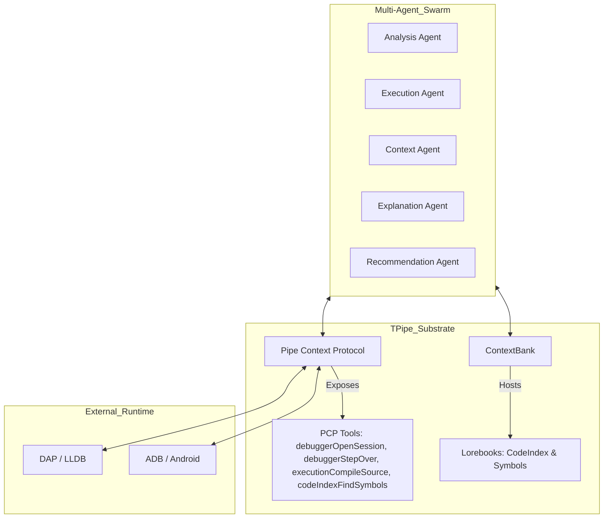
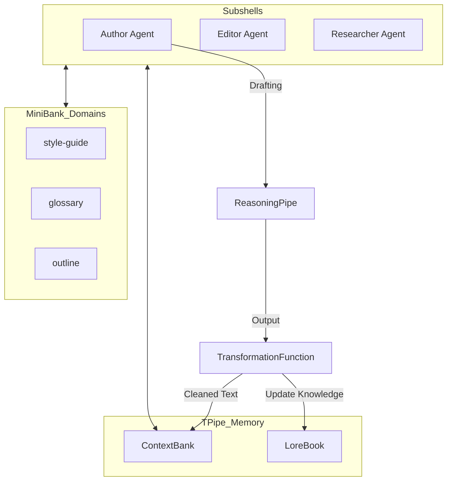
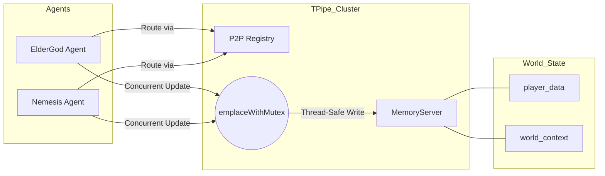

# Headless Use-Cases: TPipe in the Field

TPipe is designed for "headless-first" operations—systems that run autonomously, reliably, and without constant human supervision. These case studies illustrate how TPipe's architectural advantages translate into real-world system reliability.

## TStep: The Agentic Substrate Debugger

**The Challenge:** AI coding agents often struggle with debugging code. Without a way to interact with a live runtime, these agents are blind to the actual state of the program they are trying to repair. 

**The TPipe Solution:** TStep is an agentic step-through debugger built natively on the TPipe substrate. It automates program execution, interaction, and real-time debugging for AI coding agents by driving low-level debuggers (like **LLDB**) via the **Debug Adapter Protocol (DAP)** and **Android Debug Bridge (ADB)**.

TStep utilizes a multi-agent swarm where specialized roles collaborate to diagnose and resolve failures:
- **Analysis Agent**: Scans logs and stack traces to identify potential failure points.
- **Execution Agent**: Compiles source code and manages the debugger session.
- **Context Agent**: Maintains a live view of variables, memory, and symbols.
- **Explanation Agent**: Interprets debugger output for the LLM.
- **Recommendation Agent**: Proposes and validates fixes.

The system leverages the Pipe Context Protocol (PCP) to expose critical debugging tools directly to the swarm:
- `debuggerOpenSession`: Initializes the DAP/ADB connection.
- `debuggerStepOver` / `debuggerStepInto`: Controls execution flow.
- `executionCompileSource`: Triggers incremental builds to test fixes.
- `codeIndexFindSymbols`: Resolves function and variable locations across the codebase.

**The Outcome:** LLMs can now test for bugs, capture crashes in real-time, step through code to observe variable mutations, and identify the root cause of issues with 100% grounding in reality.

## TPipeWriter: Long-Horizon Manuscript Orchestration

**The Challenge:** Maintaining consistency in terminology, character arcs, and technical definitions across a 300-page manuscript is impossible for a single LLM call. Context drift and "forgetting" are the primary failure modes for long-form content generation.

**The TPipe Solution:** TPipeWriter uses a hierarchical memory architecture to maintain a "single source of truth" across months of drafting. 

- **Domain Isolation**: It employs `MiniBank` to segregate critical information into distinct domains: `style-guide` (tone and formatting), `glossary` (technical terms), and `outline` (structural integrity).
- **Persistent Memory**: `ContextBank` stores persistent research nodes and chat history across multiple subshells (Author, Editor, Researcher, Fact-Checker).
- **Automated Workflow**: It uses `TransformationFunction` for automated `LoreBook` updates and story text cleanup, ensuring that as the narrative evolves, the reference material stays synchronized.
- **Complex Drafting**: `ReasoningPipe` is used to generate "thinking steps" before drafting, allowing the agent to plan complex narrative arcs or technical explanations before committing to text.

**The Outcome:** A coherent, 300-page document where the beginning and end are perfectly aligned. TPipe's managed memory reservoir allowed the agent to "remember" details across a horizon far larger than any single model's context window.

## Autogenesis: The Persistent Game Master

**The Challenge:** Creating a living, autonomous simulation where multiple agents interact and evolve asynchronously. The simulation must maintain state integrity across concurrent updates and scale across multiple nodes.

**The TPipe Solution:** Autogenesis serves as a persistent world-engine, relying on TPipe's robust state management and P2P networking.

- **Specialized Roles**: The simulation is driven by the **ElderGod** (World-Engine/Narrator) and the **Nemesis** (Adversary), who manage the overarching narrative and conflict.
- **State Integrity**: To maintain world state across concurrent agent actions, Autogenesis uses the `emplaceWithMutex` pattern. This ensures thread-safe updates to global world state, such as `player_data` and `world_context`.
- **Headless Deployment**: The system runs as a cluster of headless TPipe processes that interact via a centralized `MemoryServer` and a `P2P Registry` for agent discovery and routing.

**The Outcome:** A truly persistent world. Because TPipe handles the synchronization and persistence of the "lore," the agents can operate independently and asynchronously. If a node fails, the `P2P Registry` reroutes traffic, and the `MemoryServer` ensures no state is lost.

---

These examples demonstrate that TPipe is more than a library—it is the environment that makes complex, long-running, and mission-critical AI applications possible.
