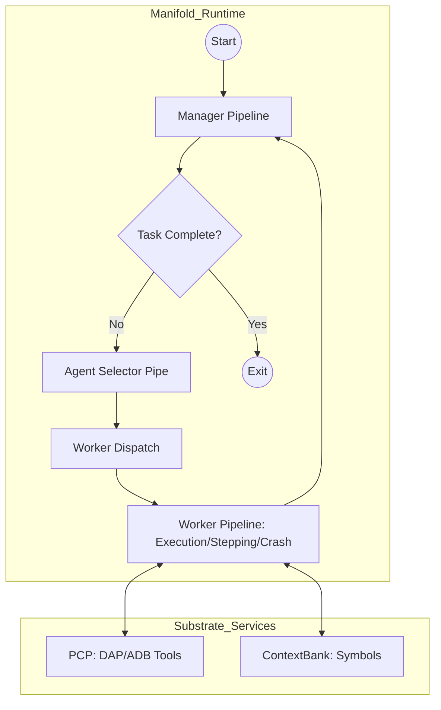
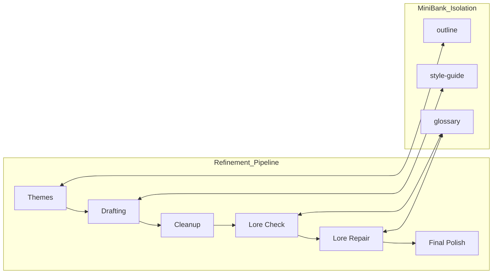
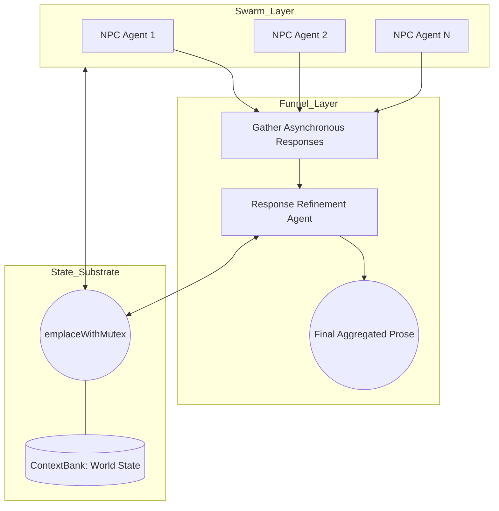

# Headless Use-Cases: TPipe in the Field

TPipe is designed for headless-first operations—systems that run autonomously, reliably, and without constant human supervision. These case studies illustrate how TPipe's architectural advantages translate into real-world system reliability.

## TStep: The Agentic Substrate Debugger

**The Challenge:** AI coding agents often struggle with debugging code. Without a way to interact with a live runtime, these agents are blind to the actual state of the program they are trying to repair. 

**The TPipe Solution:** TStep is an agentic step-through debugger built natively on the TPipe substrate. It automates program execution, interaction, and real-time debugging for AI coding agents by driving low-level debuggers (like **LLDB**) via the **Debug Adapter Protocol (DAP)** and **Android Debug Bridge (ADB)**.

TStep operates through a **Manifold manager-worker hierarchy**, utilizing a **cyclic orchestration loop** to diagnose and resolve failures. The `Manager Pipeline` continuously evaluates `TaskProgress` to determine if the debugging objective has been met.

If the task is incomplete, the system enters a refinement cycle:
- **Agent Selector Pipe**: Analyzes the current state and selects the optimal worker.
- **Worker Pipelines**: Specialized pipelines (e.g., `Execution`, `Stepping`, or `Crash Analysis`) are dispatched to perform discrete actions.
- **State Feedback**: Workers interact with the `PCP` and `ContextBank` to execute debugger commands and retrieve symbols, feeding results back to the `Manager Pipeline` for the next iteration.

The system leverages the Pipe Context Protocol (PCP) to expose critical debugging tools directly to the workers:
- `debuggerOpenSession`: Initializes the DAP/ADB connection.
- `debuggerStepOver` / `debuggerStepInto`: Controls execution flow.
- `executionCompileSource`: Triggers incremental builds to test fixes.
- `codeIndexFindSymbols`: Resolves function and variable locations across the codebase.

**The Outcome:** LLMs can now test for bugs, capture crashes in real-time, step through code to observe variable mutations, and identify the root cause of issues with 100% grounding in reality.

## TPipeWriter: Long-Horizon Manuscript Orchestration

**The Challenge:** Maintaining consistency in terminology, character arcs, and technical definitions across a 300-page manuscript is impossible for a single LLM call. Context drift and "forgetting" are the primary failure modes for long-form content generation.

**The TPipe Solution:** TPipeWriter implements a **multi-stage linear refinement path** to maintain a "single source of truth" across months of drafting.

- **Domain Isolation via MiniBank**: It employs `MiniBank` to segregate critical information into distinct, isolated domains: `style-guide` (tone and formatting), `glossary` (technical terms), and `outline` (structural integrity). This ensures that each stage of the pipeline only interacts with relevant context.
- **Linear Pipeline Sequence**: The orchestration follows a strict sequence of 15+ specialized `Pipes` (e.g., `Themes`, `Drafting`, `Lore Check`, `Final Polish`). Each pipe refines the manuscript while maintaining strict adherence to the isolated `MiniBank` domains.
- **Persistent Memory**: `ContextBank` stores persistent research nodes and chat history, providing a stable foundation for the entire linear progression.

**The Outcome:** A coherent, 300-page document where the beginning and end are perfectly aligned. TPipe's managed memory reservoir allowed the agent to "remember" details across a horizon far larger than any single model's context window.

## Autogenesis: The Persistent Game Master

**The Challenge:** Creating a living, autonomous simulation where multiple agents interact and evolve asynchronously. The simulation must maintain state integrity across concurrent updates and scale across multiple nodes.

**The TPipe Solution:** Autogenesis serves as a persistent world-engine, utilizing a **swarm-to-funnel architecture** to manage complex, asynchronous agent interactions.

- **Swarm-to-Funnel Logic**: Multiple parallel `NPC Agents` (the swarm) generate independent actions and dialogue. These asynchronous responses are then aggregated into a single `Refinement Agent` (the funnel), which synthesizes the final aggregated prose for the world state.
- **Thread-Safe State Writes via emplaceWithMutex**: To maintain world state integrity across concurrent swarm updates, Autogenesis uses the `emplaceWithMutex` pattern. This ensures that updates to `ContextBank` (e.g., `player_data`, `world_context`) are atomic and thread-safe.
- **Headless Deployment**: The system runs as a cluster of headless TPipe processes that interact via a centralized `MemoryServer` and a `P2P Registry` for agent discovery and routing.

**The Outcome:** A truly persistent world. Because TPipe handles the synchronization and persistence of the "lore," the agents can operate independently and asynchronously. If a node fails, the `P2P Registry` reroutes traffic, and the `MemoryServer` ensures no state is lost.

---

These examples can be found here: 

TPipeWriter: [https://github.com/Ten-Trillion-Triangles/TPipeWriter/tree/release]
TStep: (Coming soon)
Autogenesis: (Coming soon)