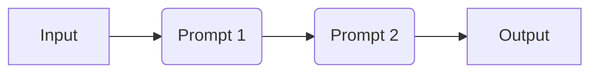
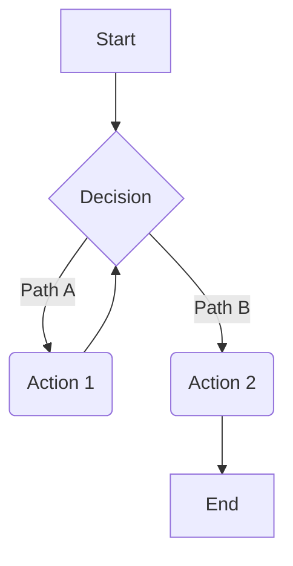
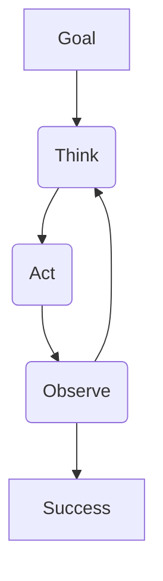
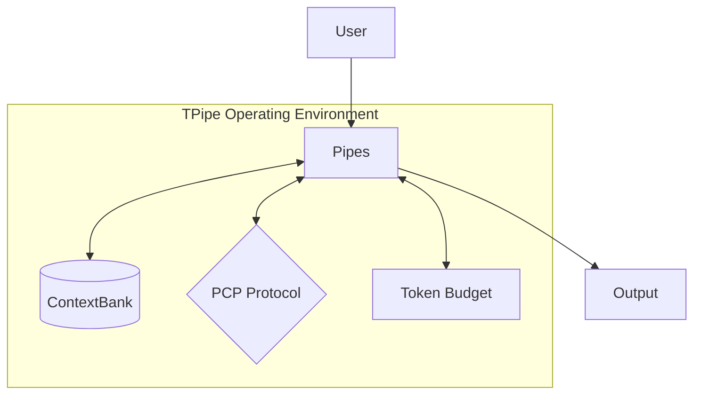

# Why TPipe? Architectural Deep Dive

TPipe represents a paradigm shift in how we build and deploy AI agents. While many frameworks treat agents as a series of library calls, TPipe treats them as residents of a **Managed Operating Environment**—a substrate that provides the necessary infrastructure for reliability, persistence, and governance.

## The Evolution of Agent Architectures

To understand why TPipe is different, we must look at the four primary paradigms of AI agent construction:

### 1. Chains (Linear)
The simplest form of AI interaction. A prompt goes in, a response comes out, and perhaps it's passed to another prompt. It is rigid and lacks the ability to handle complexity or error recovery.

### 2. Graphs (Cyclic)
Graphs introduce branching and loops. Agents can revisit previous states or choose different paths based on logic. However, the state management is often left to the developer, leading to "spaghetti logic" in complex systems.

### 3. Harnesses (Behavioral Loops)
Harnesses wrap the agent in a specific behavioral loop (e.g., ReAct). They provide a structure for thinking and acting but are often limited to a single "brain" and struggle with long-term memory or resource governance.

### 4. Substrates (TPipe: Managed Environments)
TPipe is a **Substrate**. It doesn't just chain calls; it provides the "municipal plumbing" (Pipes, Reservoirs, Mainlines) that agents inhabit. The substrate manages memory, enforces protocols, and governs resources, allowing agents to be headless, persistent, and deterministic.

## Solving the Agent Problem

TPipe was built to solve the four fundamental problems that prevent AI agents from being production-ready:

### 1. Persistence (ContextBank)
Most agents lose their "soul" the moment the process ends. TPipe's **ContextBank** provides a global, persistent memory layer. Agents can store lore, session history, and state across restarts and even across different physical machines.

### 2. Governance (Pipe Context Protocol - PCP)
Tool use is often chaotic. TPipe introduces **PCP**, a standardized protocol for tool execution. Whether a tool is written in Kotlin, JavaScript, or Python, it follows the same strict contract, ensuring that the agent's interaction with the world is predictable and secure.

### 3. Resources (Token Budgeting)
Runaway agents can drain budgets in minutes. TPipe treats tokens as a finite resource. With built-in token counting, truncation strategies, and budget enforcement, you can deploy agents with the confidence that they won't exceed their allocated costs.

### 4. Control (Pause/Resume/Jump)
In a library-based approach, once an agent starts, it's a black box. TPipe provides **Deterministic Control**. You can pause a pipeline at any point, inspect the state, modify the context, and resume—or even jump to a different stage entirely.

## Substrate vs. Library: The TPipe Advantage

| Feature | Library Approach | TPipe Substrate |
| :--- | :--- | :--- |
| **Tool Execution** | Ad-hoc function calls | Standardized Protocol (PCP) |
| **Memory** | Local variables/State objects | Managed Reservoir (ContextBank) |
| **State** | Ephemeral | Persistent & Addressable |
| **Governance** | Manual checks | Built-in Resource Accounting |
| **Deployment** | Script-based | Headless-first Service |

By moving from a library to a substrate, TPipe allows developers to focus on the *behavior* of the agent rather than the *plumbing* required to keep it running. TPipe is the foundation upon which reliable, autonomous, and enterprise-grade AI systems are built.
