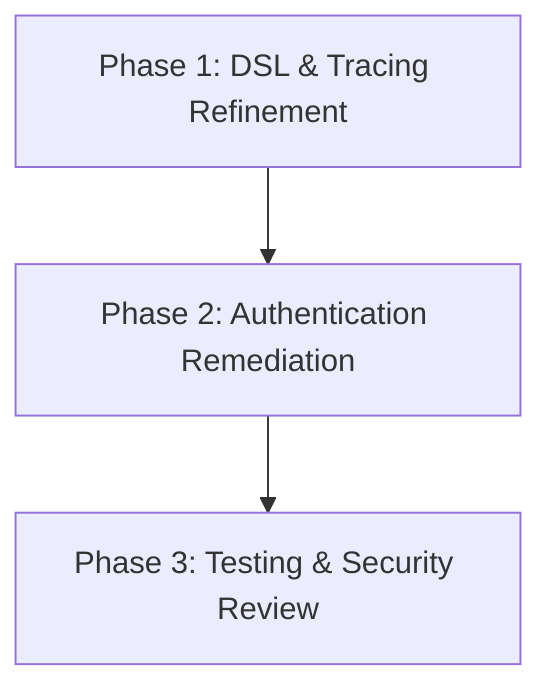

# Implementation Plan: Junction System Refinement & Bug Fixes

## 1. Plan Overview
- **Total Phases**: 3
- **Agents Involved**: `coder`, `tester`, `code_reviewer`
- **Estimated Effort**: Low-Medium
- **Objective**: Remediate the authentication bypass, add asynchronous DSL support, and ensure accurate trace logging for pipeline status.

## 2. Dependency Graph


## 3. Execution Strategy Table

| Phase | Description | Agent | Mode | Risk |
|-------|-------------|-------|------|------|
| 1 | Implement `buildSuspend()` and Audit Tracing | `coder` | Sequential | Low |
| 2 | Remediation of Auth Bypass Bug | `coder` | Sequential | Medium |
| 3 | Verification Tests & Final Review | `tester` | Sequential | Low |

## 4. Phase Details

### Phase 1: DSL & Tracing Refinement
- **Objective**: Add `buildSuspend()` to `JunctionDsl.kt` and ensure tracing logic correctly reflects success vs termination.
- **Agent**: `coder`
- **Files to Modify**:
    - `src/main/kotlin/Pipeline/JunctionDsl.kt`: Add `buildSuspend()` and KDoc warnings to `build()`.
    - `src/main/kotlin/Pipeline/Junction.kt`: Audit `executeWorkflow` tracing logic.
- **Implementation Details**:
    - **`JunctionDsl.kt`**:
        ```kotlin
        /**
         * Asynchronously build and initialize the configured Junction.
         * ...
         */
        suspend fun buildSuspend(): Junction {
            val descriptor = junction.getP2pDescription()
            val requirements = junction.getP2pRequirements()
            if(descriptor?.requiresAuth == true || requirements?.authMechanism != null) {
                requireNotNull(requirements?.authMechanism) { ... }
            }
            junction.init()
            return junction
        }
        ```
    - **`Junction.kt`**: Ensure `JUNCTION_WORKFLOW_SUCCESS` is emitted when `workflowState.completed` is true, and that `terminatePipeline` flags are only set on actual errors or requested stops.
- **Validation**: Build the project and ensure no compilation errors.
- **Dependencies**: None

### Phase 2: Authentication Remediation
- **Objective**: Secure `executeP2PRequest` by enforcing authentication if an `authMechanism` is present.
- **Agent**: `coder`
- **Files to Modify**:
    - `src/main/kotlin/Pipeline/Junction.kt`: Update `executeP2PRequest` logic.
- **Implementation Details**:
    - **`Junction.kt`**:
        ```kotlin
        val requiresAuth = p2pDescriptor?.requiresAuth ?: (p2pRequirements?.authMechanism != null)
        if (requiresAuth) {
            val authMechanism = p2pRequirements?.authMechanism
            if (authMechanism == null) {
                throw SecurityException("Authentication is required but no mechanism is provided.")
            }
            // ... perform auth ...
        }
        ```
- **Validation**: Ensure remote calls with missing tokens are rejected when an `authMechanism` is configured.
- **Dependencies**: `blocked_by`: [1]

### Phase 3: Testing & Security Review
- **Objective**: Add regression tests and perform a final security pass.
- **Agent**: `tester`
- **Files to Modify**:
    - `src/test/kotlin/Pipeline/JunctionTest.kt`: Add tests for `buildSuspend()` and the new auth logic.
- **Implementation Details**:
    - Add `testJunctionDslBuildSuspend`.
    - Add `testAuthEnforcementWithMissingDescriptor` (verifying fix for bug 2).
    - Add `testPassPipelineTracingAccuracy`.
- **Validation**: `./gradlew :test --tests "com.TTT.Pipeline.JunctionTest"`
- **Dependencies**: `blocked_by`: [2]

## 5. File Inventory

| File | Phase | Purpose |
|------|-------|---------|
| `src/main/kotlin/Pipeline/JunctionDsl.kt` | 1 | DSL improvements. |
| `src/main/kotlin/Pipeline/Junction.kt` | 1, 2 | Tracing and Auth fixes. |
| `src/test/kotlin/Pipeline/JunctionTest.kt` | 3 | Regression tests. |

## 6. Risk Classification
- **Phase 1 (Low)**: New DSL method is additive.
- **Phase 2 (Medium)**: Changes to core auth logic could impact existing integrations if not tested thoroughly.
- **Phase 3 (Low)**: Verification only.

## 7. Execution Profile
- Total phases: 3
- Parallelizable phases: 0
- Estimated sequential wall time: 5-10 minutes.

## 8. Cost Estimation Summary

| Phase | Agent | Model | Est. Input | Est. Output | Est. Cost |
|-------|-------|-------|-----------|------------|----------|
| 1 | `coder` | `gemini-2.5-pro` | 15000 | 500 | $0.17 |
| 2 | `coder` | `gemini-2.5-pro` | 15000 | 300 | $0.16 |
| 3 | `tester` | `gemini-2.5-pro` | 15000 | 800 | $0.18 |
| **Total** | | | **45000** | **1600** | **$0.51** |
