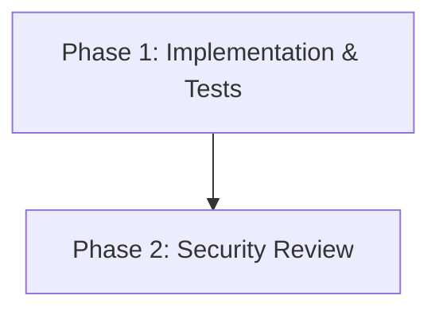

# Implementation Plan: Junction P2P Authentication Remediation

## 1. Plan Overview
- **Total Phases**: 2
- **Agents Involved**: `coder`, `code_reviewer`
- **Estimated Effort**: Low (targeted additions to existing classes)
- **Objective**: Add mandatory authentication checks to `Junction.executeP2PRequest` and build-time validation to `JunctionDsl.build()`.

## 2. Dependency Graph


## 3. Execution Strategy Table

| Phase | Description | Agent | Mode | Risk |
|-------|-------------|-------|------|------|
| 1 | Implement Auth Validation & Tests | `coder` | Sequential | Medium |
| 2 | Final Security Review | `code_reviewer` | Sequential | Low |

## 4. Phase Details

### Phase 1: Implement Auth Validation & Tests
- **Objective**: Implement the runtime authentication check in `Junction.kt`, add DSL validation in `JunctionDsl.kt`, and write unit tests in `JunctionTest.kt`.
- **Agent**: `coder`
- **Files to Modify**:
    - `src/main/kotlin/P2P/P2PInterface.kt` (Ensure correct exception throwing behavior is documented if needed)
    - `src/main/kotlin/Pipeline/Junction.kt`
    - `src/main/kotlin/Pipeline/JunctionDsl.kt`
    - `src/test/kotlin/Pipeline/JunctionTest.kt`
- **Implementation Details**:
    - **`Junction.kt`**: In `executeP2PRequest(request: P2PRequest)`, add the following logic at the very beginning of the method:
        ```kotlin
        val requiresAuth = p2pDescriptor?.requiresAuth ?: false
        if (requiresAuth) {
            val authMechanism = p2pRequirements?.authMechanism
            requireNotNull(authMechanism) { "Junction requires authentication, but no authMechanism is provided in P2PRequirements." }
            
            val isAuthenticated = authMechanism(request.authBody)
            if (!isAuthenticated) {
                 // Throw a SecurityException or use require/check to fail the request immediately.
                 throw SecurityException("Authentication failed for Junction P2P request.")
            }
        }
        ```
    - **`JunctionDsl.kt`**: In `build()`, right before calling `junction.init()`, add a check:
        ```kotlin
        val descriptor = junction.getP2pDescription()
        val requirements = junction.getP2pRequirements()
        if (descriptor?.requiresAuth == true) {
            requireNotNull(requirements?.authMechanism) {
                "JunctionDsl: P2PDescriptor requiresAuth is true, but no authMechanism was provided in P2PRequirements."
            }
        }
        ```
    - **`JunctionTest.kt`**: Add two new tests:
        1.  `testJunctionP2PAuthSuccess`: Create a Junction with `requiresAuth = true` and a mock `authMechanism` that returns `true` for a specific token. Call `executeP2PRequest` with the valid token and ensure it succeeds.
        2.  `testJunctionP2PAuthFailure`: Create a Junction with `requiresAuth = true` and a mock `authMechanism` that returns `false`. Call `executeP2PRequest` and ensure it throws a `SecurityException` (or whatever exception type is chosen).
        3.  `testJunctionDslAuthValidation`: Test that building a DSL with `requiresAuth = true` but no `authMechanism` throws an `IllegalArgumentException`.
- **Validation**: `./gradlew :TPipe:test --tests "*JunctionTest*"`
- **Dependencies**: None (`blocked_by`: [])

### Phase 2: Final Security Review
- **Objective**: Conduct a final review of the implemented code to ensure it meets the "fail-closed" requirement and introduces no new vulnerabilities.
- **Agent**: `code_reviewer`
- **Files to Modify**: None (Read-only)
- **Validation**: N/A (assessment only)
- **Dependencies**: `blocked_by`: [1]

## 5. File Inventory

| File | Phase | Purpose |
|------|-------|---------|
| `src/main/kotlin/Pipeline/Junction.kt` | 1 | Add runtime auth check to `executeP2PRequest`. |
| `src/main/kotlin/Pipeline/JunctionDsl.kt` | 1 | Add build-time validation for auth config. |
| `src/test/kotlin/Pipeline/JunctionTest.kt` | 1 | Add tests for auth success, auth failure, and DSL validation. |

## 6. Risk Classification
- **Phase 1 (Medium)**: Modifying the core `executeP2PRequest` method could break existing remote integrations if they are currently relying on the lack of enforcement. The tests must be robust.
- **Phase 2 (Low)**: Read-only review phase.

## 7. Execution Profile
- Total phases: 2
- Parallelizable phases: 0
- Sequential-only phases: 2
- Estimated parallel wall time: N/A
- Estimated sequential wall time: 2-4 minutes

## 8. Cost Estimation Summary

| Phase | Agent | Model | Est. Input | Est. Output | Est. Cost |
|-------|-------|-------|-----------|------------|----------|
| 1 | `coder` | `gemini-2.5-pro` | 12000 | 500 | $0.14 |
| 2 | `code_reviewer` | `gemini-2.5-pro` | 12000 | 100 | $0.12 |
| **Total** | | | **24000** | **600** | **$0.26** |
